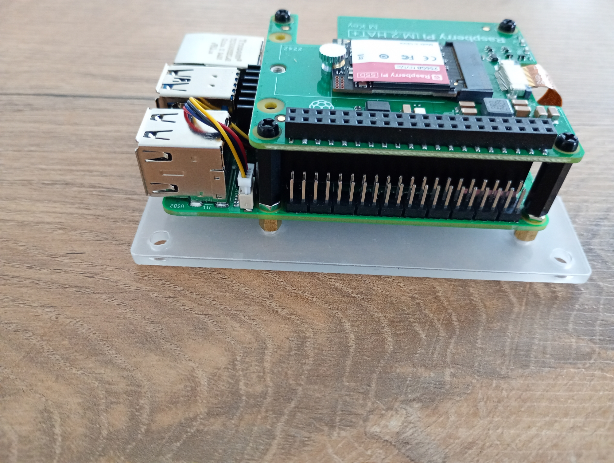
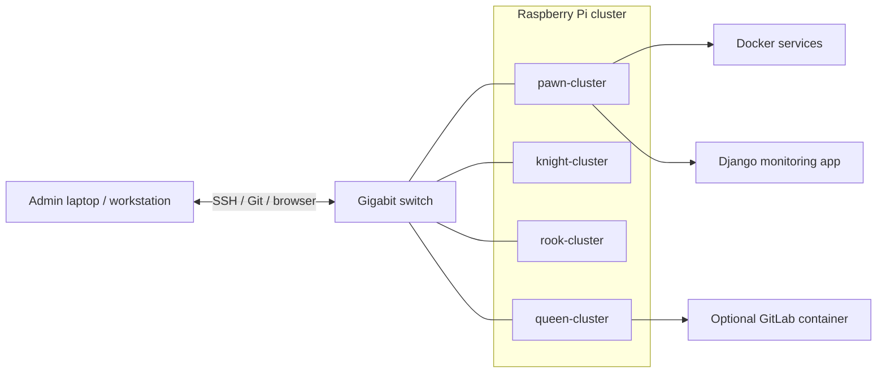
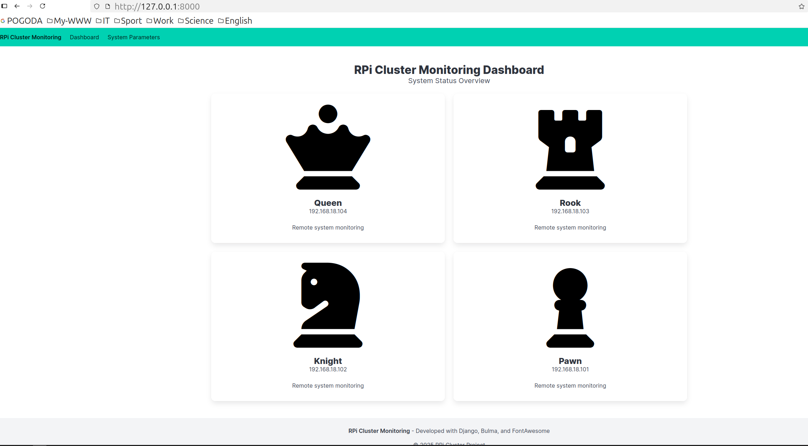

# RPi-cluster-2025

A build log for a Raspberry Pi cluster: hardware selection, OS installation, NVMe boot, Docker, SSH, `uv`, Django, and the automation around them.

## Table of Contents
- [Overview](#overview)
- [Cluster Layout](#cluster-layout)
- [Repository Contents](#repository-contents)
- [Documentation Map](#documentation-map)
- [Current Status](#current-status)
- [License](#license)
- [Contact](#contact)

## Overview
The project documents the full path from unpacking Raspberry Pi hardware to a working local cluster with shared networking, passwordless SSH, Docker-based services, and a Django monitoring app.

The documentation is intentionally practical:
- it starts with the equipment and assembly,
- moves through OS installation on SD cards and NVMe drives,
- then covers Docker, Python tooling, SSH, and pre-commit hooks,
- and finishes with optional services such as GitLab and extra hardware notes.

## Cluster Layout

## Repository Contents
| Path | Purpose |
| --- | --- |
| `docs/` | Step-by-step build notes and reference material |
| `images/` | Photos and screenshots used in the documentation |
| `django_rpi_cluster/` | Django project used for cluster monitoring |
| `scripts/` | Helper scripts, reports, and local automation |
| `systemd_service/` | Example systemd service for the Python stack |

## Documentation Map
Start with the overview, then follow the numbered docs in order.

| Order | File | Focus |
| --- | --- | --- |
| 00 | [00_overview.md](docs/00_overview.md) | Project summary, build flow, and visuals |
| 01 | [01_equipment_before_unpacking.md](docs/01_equipment_before_unpacking.md) | Hardware list and costs |
| 02 | [02_after_unpacking.md](docs/02_after_unpacking.md) | Unboxing and assembly photos |
| 03 | [03_installing_OS_on_RPi-SD-card.md](docs/03_installing_OS_on_RPi-SD-card.md) | Raspberry Pi OS on SD cards |
| 04 | [04_installing_OS_on_RPi-NVMe_disk.md](docs/04_installing_OS_on_RPi-NVMe_disk.md) | Raspberry Pi OS on NVMe drives |
| 05 | [05_installing_Docker_on_RPi.md](docs/05_installing_Docker_on_RPi.md) | Docker installation and post-install steps |
| 06 | [06_uv_and_Django_on_RPi.md](docs/06_uv_and_Django_on_RPi.md) | `uv` and Django setup |
| 07 | [07_git_and_passwordless_SSH_configuration.md](docs/07_git_and_passwordless_SSH_configuration.md) | Git config and SSH key exchange |
| 08 | [08_pre-commit.md](docs/08_pre-commit.md) | Hook-based linting and formatting checks |
| 09 | [09_Gitlab_in_Docker_container.md](docs/09_Gitlab_in_Docker_container.md) | Optional GitLab container notes |
| 10 | [10_links.md](docs/10_links.md) | External references used during the build |
| 11 | [11_my_additional_devices_for_optional_usage.md](docs/11_my_additional_devices_for_optional_usage.md) | Optional peripherals and expansion ideas |

## Current Status
- Hardware is documented with photos and a component list.
- OS installation on SD card and NVMe boot is covered.
- Docker, `uv`, Django, SSH, and pre-commit are already documented.
- Optional services and future expansion remain open for the next iteration.

## License
Distributed under the MIT License. See [`LICENSE.txt`](LICENSE.txt) for details.

## Contact
Artur Zacniewski - [@zacniewski](https://x.com/zacniewski) - a.zacniewski@we.umg.edu.pl
