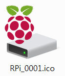

# RPi-cluster-2025
Description of the process of building RPi cluster

## What do I have?
  - camera [IC-7112W](https://pl.edimax.pl/edimax/merchandise/merchandise_detail/data/edimax/pl/home_network_cameras_indoor_ptz/ic-7112w/)
  - camera [OAK-D Lite](https://docs.luxonis.com/hardware/products/OAK-D%20Lite),
  - camera [CamSpot 5.0 WiFi 1080p](https://botland.com.pl/produkty-wycofane/15582-kamera-ip-overmax-camspot-50-wifi-1080p-5902581657732.html) (not sold already),  


## Links
  - Docker [Swarm](https://docs.docker.com/engine/swarm/),
  - Docker Swarm [vs](https://spacelift.io/blog/docker-swarm-vs-kubernetes) K8s,
  - Deploy OAK-D Lite with [RPi](https://docs.luxonis.com/hardware/platform/deploy/to-rpi/),  


<!-- Improved compatibility of back to top link: See: https://github.com/othneildrew/Best-README-Template/pull/73 -->
<a id="readme-top"></a>
<!--
*** Thanks for checking out the Best-README-Template. If you have a suggestion
*** that would make this better, please fork the repo and create a pull request
*** or simply open an issue with the tag "enhancement".
*** Don't forget to give the project a star!
*** Thanks again! Now go create something AMAZING! :D
-->


<!-- PROJECT SHIELDS -->
<!--
*** I'm using markdown "reference style" links for readability.
*** Reference links are enclosed in brackets [ ] instead of parentheses ( ).
*** See the bottom of this document for the declaration of the reference variables
*** for contributors-url, forks-url, etc. This is an optional, concise syntax you may use.
*** https://www.markdownguide.org/basic-syntax/#reference-style-links
-->
[![Contributors][contributors-shield]][contributors-url]
[![Forks][forks-shield]][forks-url]
[![Stargazers][stars-shield]][stars-url]
[![Issues][issues-shield]][issues-url]
[![project_license][license-shield]][license-url]
[![LinkedIn][linkedin-shield]][linkedin-url]


<!-- PROJECT LOGO -->
<br />
<div style="align:center">
  <a href="https://github.com/zacniewski/RPi-cluster-2025">
    
  </a>

<h3 style="align:center">Rasperry Pi cluster</h3>

  <p style="align:center">
    project_description
    <br />
    <a href="https://github.com/zacniewski/RPi-cluster-2025"><strong>Explore the docs »</strong></a>
    <br />
    <br />
    <a href="https://github.com/zacniewski/RPi-cluster-2025">View Demo</a>
    &middot;
    <a href="https://github.com/zacniewski/RPi-cluster-2025/issues/new?labels=bug&template=bug-report---.md">Report Bug</a>
    &middot;
    <a href="https://github.com/zacniewski/RPi-cluster-2025/issues/new?labels=enhancement&template=feature-request---.md">Request Feature</a>
  </p>
</div>


<!-- TABLE OF CONTENTS -->
<details>
  <summary>Table of Contents</summary>
  <ol>
    <li>
      <a href="#about-the-project">About The Project</a>
      <ul>
        <li><a href="#built-with">Built With</a></li>
      </ul>
    </li>
    <li>
      <a href="#getting-started">Getting Started</a>
      <ul>
        <li><a href="#prerequisites">Prerequisites</a></li>
        <li><a href="#installation">Installation</a></li>
      </ul>
    </li>
    <li><a href="#usage">Usage</a></li>
    <li><a href="#roadmap">Roadmap</a></li>
    <li><a href="#contributing">Contributing</a></li>
    <li><a href="#license">License</a></li>
    <li><a href="#contact">Contact</a></li>
    <li><a href="#acknowledgments">Acknowledgments</a></li>
  </ol>
</details>


<!-- ABOUT THE PROJECT -->
## About The Project

[![Product Name Screen Shot][product-screenshot]](https://example.com)

Here's a blank template to get started. To avoid retyping too much info, do a search and replace with your text editor for the following: `zacniewski`, `RPi-cluster-2025`, `twitter_handle`, `linkedin_username`, `email_client`, `email`, `project_title`, `project_description`, `project_license`

<p style="align:right">(<a href="#readme-top">back to top</a>)</p>


### Built With

* [![RPi][RPi.com]][RPi-url]
* [![Nginx][Nginx.org]][Nginx-url]
* [![Django][Django.com]][Django-url]
* [![Docker][Docker.com]][Docker-url]
* [![Spark][Spark.org]][Spark-url]
* [![Github][Github.com]][Github-url]
* [![Gitlab][Gitlab.com]][Gitlab-url]
* [![Bootstrap][Bootstrap.com]][Bootstrap-url]
* [![AlpineJS][Alpine.js]][Alpine-url]

<p style="align:right">(<a href="#readme-top">back to top</a>)</p>


<!-- GETTING STARTED -->
## Getting Started

This is an example of how you may give instructions on setting up your project locally.
To get a local copy up and running follow these simple example steps.

### Prerequisites

This is an example of how to list things you need to use the software and how to install them.
* npm
  ```sh
  npm install npm@latest -g
  ```

### Installation

1. Get a free API Key at [https://example.com](https://example.com)
2. Clone the repo
   ```sh
   git clone https://github.com/zacniewski/RPi-cluster-2025.git
   ```
3. Install NPM packages
   ```sh
   npm install
   ```
4. Enter your API in `config.js`
   ```js
   const API_KEY = 'ENTER YOUR API';
   ```
5. Change git remote url to avoid accidental pushes to base project
   ```sh
   git remote set-url origin zacniewski/RPi-cluster-2025
   git remote -v # confirm the changes
   ```

<p style="align:right">(<a href="#readme-top">back to top</a>)</p>


<!-- USAGE EXAMPLES -->
## Usage

Use this space to show useful examples of how a project can be used. Additional screenshots, code examples and demos work well in this space. You may also link to more resources.

_For more examples, please refer to the [Documentation](https://example.com)_

<p style="align:right">(<a href="#readme-top">back to top</a>)</p>


<!-- ROADMAP -->
## Roadmap

- [ ] Feature 1
- [x] Feature 2
- [ ] Feature 3
    - [ ] Nested Feature

See the [open issues](https://github.com/zacniewski/RPi-cluster-2025/issues) for a full list of proposed features (and known issues).

<p style="align:right">(<a href="#readme-top">back to top</a>)</p>


<!-- CONTRIBUTING -->
## Contributing

Contributions are what make the open source community such an amazing place to learn, inspire, and create. Any contributions you make are **greatly appreciated**.

If you have a suggestion that would make this better, please fork the repo and create a pull request. You can also simply open an issue with the tag "enhancement".
Don't forget to give the project a star! Thanks again!

1. Fork the Project
2. Create your Feature Branch (`git checkout -b feature/AmazingFeature`)
3. Commit your Changes (`git commit -m 'Add some AmazingFeature'`)
4. Push to the Branch (`git push origin feature/AmazingFeature`)
5. Open a Pull Request

<p style="align:right">(<a href="#readme-top">back to top</a>)</p>

### Top contributors:

<a href="https://github.com/zacniewski/RPi-cluster-2025/graphs/contributors">
  
</a>


<!-- LICENSE.txt -->
## License

Distributed under the project_license. See `LICENSE.txt` for more information.

<p style="align:right">(<a href="#readme-top">back to top</a>)</p>


<!-- CONTACT -->
## Contact

Your Name - [@twitter_handle](https://twitter.com/twitter_handle) - email@email_client.com

Project Link: [https://github.com/zacniewski/RPi-cluster-2025](https://github.com/zacniewski/RPi-cluster-2025)

<p style="align:right">(<a href="#readme-top">back to top</a>)</p>


<!-- ACKNOWLEDGMENTS -->
## Acknowledgments
Below are some links, that I've useful during the process of creating this project.  
* [Best README template](https://github.com/othneildrew/Best-README-Template/blob/main/README.md)
* [Custom badges with Shield.io](https://javascript.plainenglish.io/how-to-make-custom-language-badges-for-your-profile-using-shields-io-d2aeaf016b6b)
* [Simple Icons](https://simpleicons.org/)
* [Raspberry Pi logo/wallpaper](https://www.deviantart.com/onix5/art/Raspberry-Pi-Logo-Wallpaper-4K-739821936)

<p style="align:right">(<a href="#readme-top">back to top</a>)</p>


<!-- MARKDOWN LINKS & IMAGES -->
<!-- https://www.markdownguide.org/basic-syntax/#reference-style-links -->
[contributors-shield]: https://img.shields.io/github/contributors/zacniewski/RPi-cluster-2025.svg?style=for-the-badge
[contributors-url]: https://github.com/zacniewski/RPi-cluster-2025/graphs/contributors
[forks-shield]: https://img.shields.io/github/forks/zacniewski/RPi-cluster-2025.svg?style=for-the-badge
[forks-url]: https://github.com/zacniewski/RPi-cluster-2025/network/members
[stars-shield]: https://img.shields.io/github/stars/zacniewski/RPi-cluster-2025.svg?style=for-the-badge
[stars-url]: https://github.com/zacniewski/RPi-cluster-2025/stargazers
[issues-shield]: https://img.shields.io/github/issues/zacniewski/RPi-cluster-2025.svg?style=for-the-badge
[issues-url]: https://github.com/zacniewski/RPi-cluster-2025/issues
[license-shield]: https://img.shields.io/github/license/zacniewski/RPi-cluster-2025?style=for-the-badge
[license-url]: https://github.com/zacniewski/RPi-cluster-2025/blob/main/LICENSE.txt
[linkedin-shield]: https://img.shields.io/badge/-LinkedIn-black.svg?style=for-the-badge&logo=linkedin&colorB=555
[linkedin-url]: https://linkedin.com/in/artur-zacniewski-29436928
[product-screenshot]: images/raspberry_pi_logo_wallpaper_4k_by_onix5_dc8gy9c-pre.jpg

[RPi.com]: https://img.shields.io/badge/-RaspberryPi-C51A4A?style=for-the-badge&logo=Raspberry-Pi
[RPi-url]: https://www.raspberrypi.com/
[Nginx.org]: https://img.shields.io/badge/Nginx-009639?logo=nginx&logoColor=white&style=for-the-badge
[Nginx-url]: https://nginx.org/
[Django.com]: https://img.shields.io/badge/Django-092E20?style=for-the-badge&logo=django&logoColor=white
[Django-url]: https://www.djangoproject.com/
[Docker.com]: https://img.shields.io/badge/Docker-2496ED?style=for-the-badge&logo=docker&logoColor=white
[Docker-url]: https://www.docker.com/
[Spark.org]: https://img.shields.io/badge/ApacheSpark-E25A1C?style=for-the-badge&logo=apachespark&logoColor=white
[Spark-url]: https://spark.apache.org/
[Github.com]: https://img.shields.io/badge/GitLab-FC6D26?style=for-the-badge&logo=laravel&logoColor=white
[Github-url]: https://github.com
[Gitlab.com]: https://img.shields.io/badge/GitHub-%23121011.svg?style=for-the-badge&logo=laravel&logoColor=white
[Gitlab-url]: https://gitlab.com
[Bootstrap.com]: https://img.shields.io/badge/Bootstrap-563D7C?style=for-the-badge&logo=bootstrap&logoColor=white
[Bootstrap-url]: https://getbootstrap.com
[Alpine.js]: https://img.shields.io/badge/Alpine.js-8BC0D0?style=for-the-badge&logo=alpinedotjs&logoColor=white
[Alpine-url]: https://alpinejs.dev/ 

