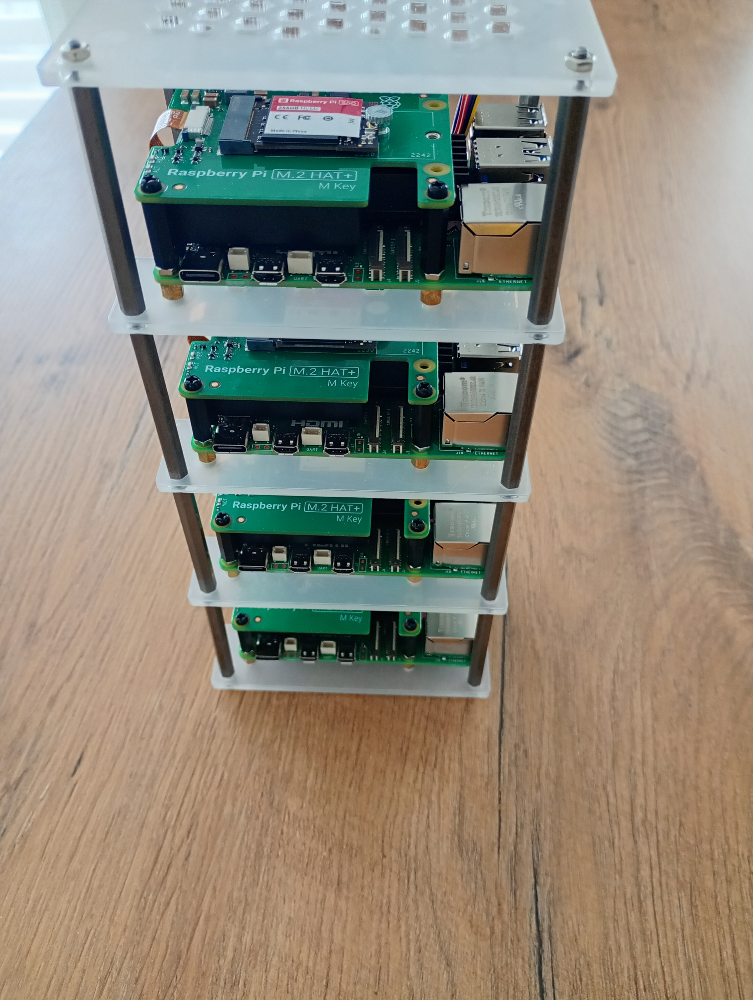
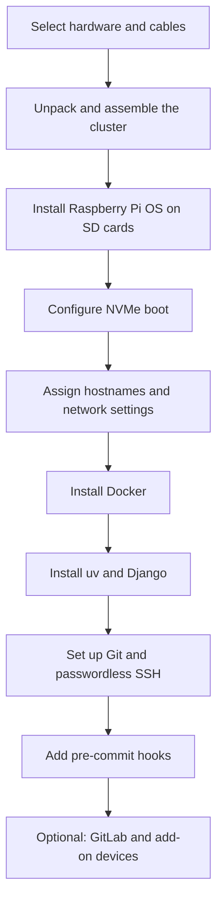

# Project Overview

This page gives a short map of the whole build. It is the best entry point if you want the documentation in one place before reading the numbered step-by-step notes.

## Table of Contents
- [What this project covers](#what-this-project-covers)
- [Build flow](#build-flow)
- [Visual references](#visual-references)
- [Reading order](#reading-order)
- [Notes](#notes)

## What this project covers
The repo documents a Raspberry Pi cluster built for experimenting with:
- local networking,
- OS installation and boot media,
- Docker-based services,
- Python application packaging with `uv`,
- Django monitoring,
- SSH automation and Git hygiene,
- optional container services and extra hardware.

## Build Flow

## Visual References
The existing photos and screenshots in `images/` are used throughout the docs.

## Reading Order
The numbered docs are arranged so the early pages cover the physical build and the later pages cover software and automation.

1. Start with the hardware list and unpacking notes.
2. Follow the OS installation guides for SD card and NVMe boot.
3. Move on to Docker, `uv`, Django, Git, and SSH.
4. Finish with pre-commit, optional GitLab, and the reference links.

## Notes
- Hostnames, IP addresses, and shell output in the docs reflect the author's local network.
- Some pages are intentionally narrative and keep command output for reproducibility.
- The project is still open for future expansion such as distributed computing, cameras, and VPN.
