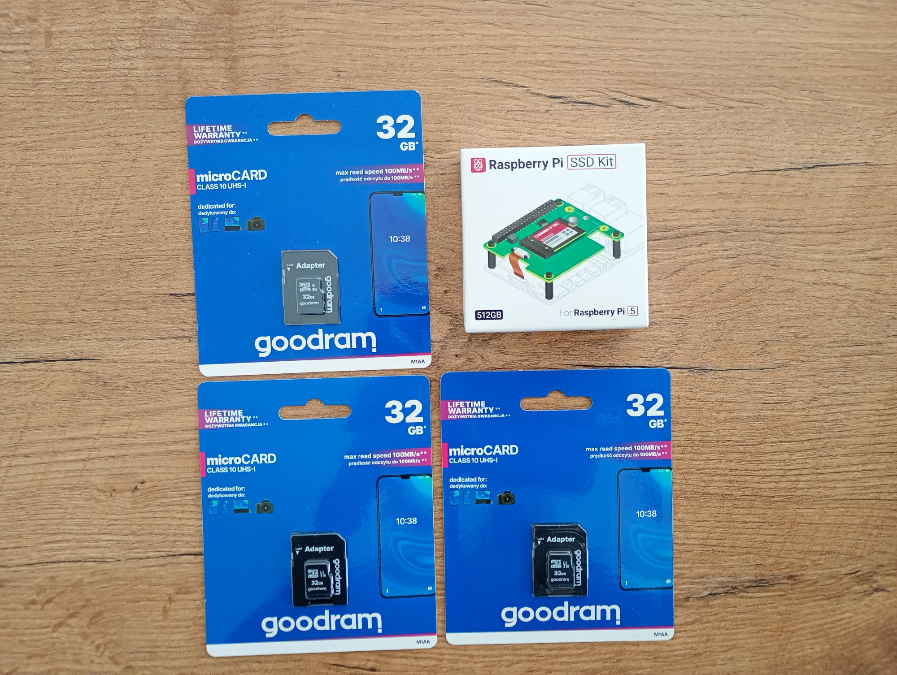
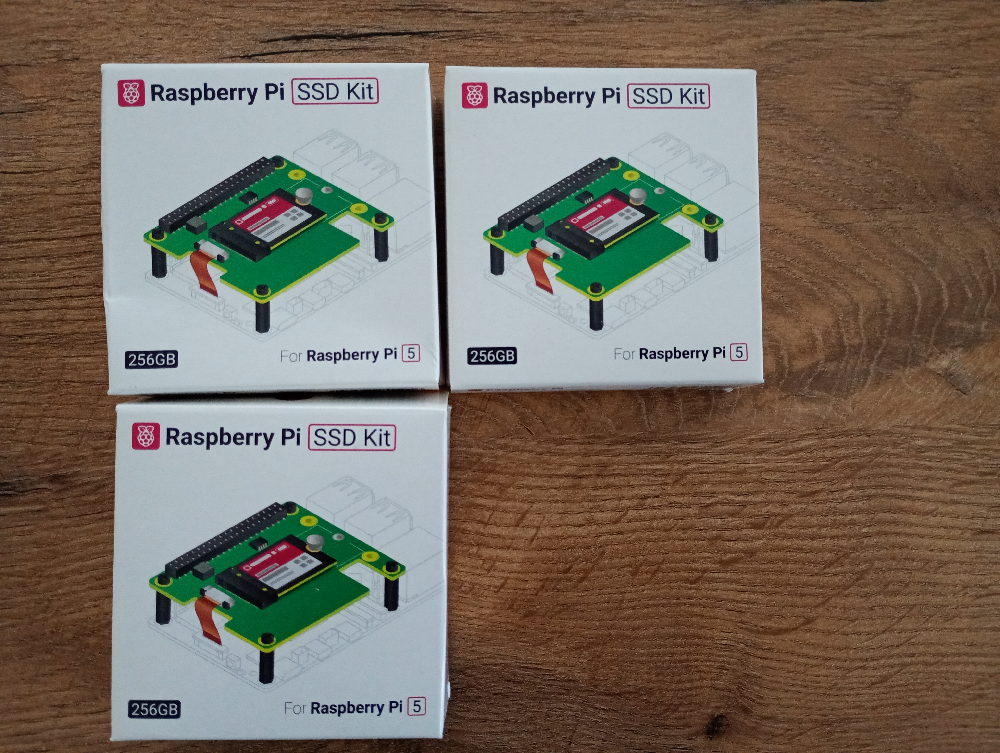
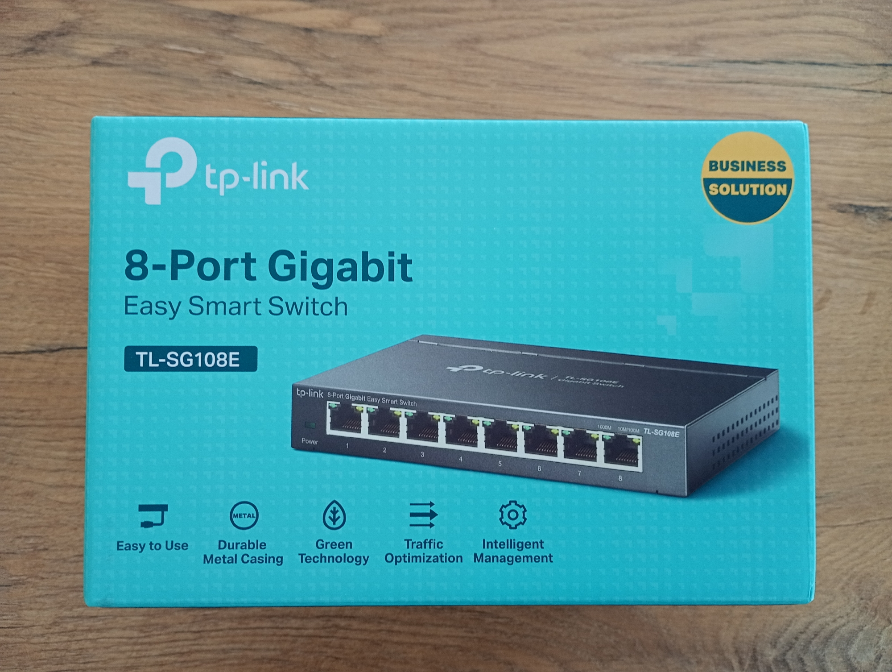
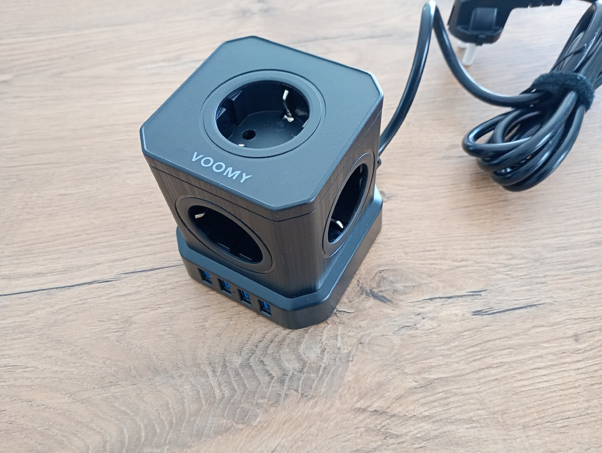
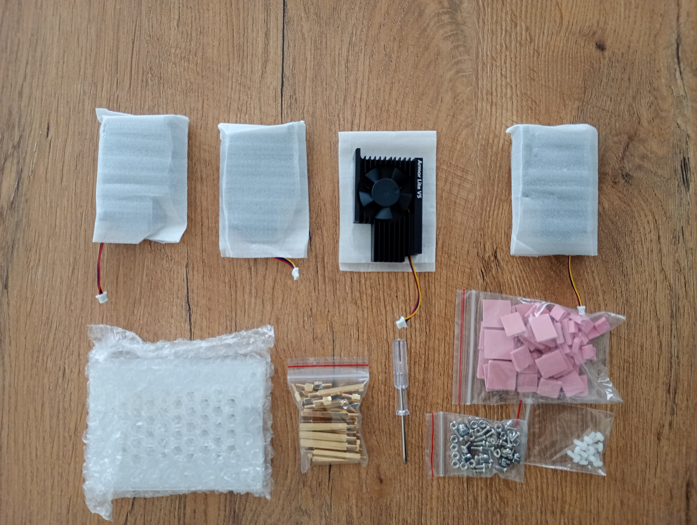
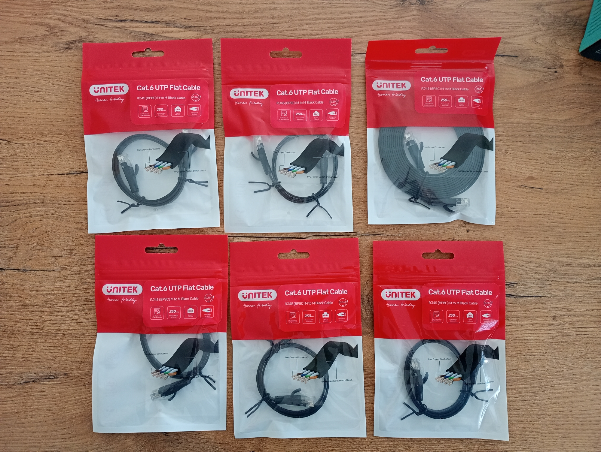

## What do I have?  
This page contains information about the devices and cables used to build the RPi cluster.  

### 1. Devices and cables
| Product                                                                                                                                                                                                                                                | Number of items | Cost (PLN) |
|:-------------------------------------------------------------------------------------------------------------------------------------------------------------------------------------------------------------------------------------------------------|:---------------:|-----------:|
| Raspberry Pi 27W USB-C [Power Supply - official 5,1V / 5A PSU](https://botland.store/raspberry-pi-5-power-supply/23907-raspberry-pi-27w-usb-c-power-supply-official-51v-5a-psu-for-raspberry-pi-5-black-5056561803418.html) for Raspberry Pi 5 - black |        4        |        240 |
| Raspberry [Pi 5](https://botland.store/raspberry-pi-5-modules-and-kits/23905-raspberry-pi-5-8gb-5056561803326.html) 8GB                                                                                                                                |        4        |       1560 |
| Memory Card [Goodram M1AA microSD 32GB](https://botland.store/microsd-sd-cards/2361-memory-card-goodram-m1aa-microsd-32gb-100mb-s-5908267930144.html) 100MB/s UHS-I Class 10 with adapter                                                              |        3        |         36 |
| Raspberry Pi [SSD Kit 512GB](https://botland.store/raspberry-pi-hat-pci-express-overlays/25484-raspberry-pi-ssd-kit-512gb-for-raspberry-pi-5-5056561805023.html) for Raspberry Pi 5                                                                    |        1        |        279 |
| Raspberry Pi [SSD Kit 256GB](https://botland.store/raspberry-pi-hat-pci-express-overlays/25485-raspberry-pi-ssd-kit-256gb-for-raspberry-pi-5-5056561805016.html) for Raspberry Pi 5                                                                    |        3        |        597 |
| Switch [TP-Link](https://www.morele.net/switch-tp-link-tl-sg108e-645352/) TL-SG108E                                                                                                                                                                    |        1        |        110 |
| Voomy Power [Cube S5 - Power Strip](https://allegro.pl/oferta/voomy-listwa-zasilajaca-5-gniazd-z-wylacznikami-czarny-14653907104) 4 USB-A & 5 EU                                                                                                       |        1        |        100 |
| GeeekPi 4-layer [acrylic housing with Armor Lite](https://www.amazon.pl/GeeekPi-4-warstwowa-akrylowa-radiator-Raspberry/dp/B0CYL9L9GW?th=1) V5 Active Cooler radiator for Raspberry Pi 5 4GB / 8GB                                                     |        1        |        133 |
| Network [Cable RJ45 - RJ45](https://www.morele.net/unitek-rj45-rj45-cat-6-0-5m-czarny-c1808gbk-10163834/), Cat.6, 0.5m                                                                                                                                 |        5        |         29 |
| Network [Cable UTP](https://www.morele.net/unitek-kabel-sieciowy-plaski-utp-ethernet-cat-6-3m-c1811gbk-7465408/) Ethernet Cat.6 3m                                                                                                                     |        1        |          8 |

**Total cost:** 3092 PLN

### 2. Power Supply
- 4 x power supply for Raspberry Pi 5

### 3. Raspberry Pi 5
- 4 x Raspberry Pi 5 with 8 GB
  

### 4. Memory Cards
- 3 x Goodram M1AA microSD 32GB 100MB/s UHS-I Class 10 with adapter

### 5. Raspberry Pi SSD Kits
- 3 x Raspberry Pi SSD Kit 256 GB
- 1 x Raspberry Pi SSD Kit 512 GB

### 6. Switch 
- 1 x TP-Link TL-SG108E
  

### 7. Voomy Power Cube S5 
- 1 x Voomy Power Cube S5 - Power Strip 4 USB-A & 5 EU

### 8. GeeekPi 4-layer acrylic housing 
- 1 x GeeekPi 4-layer acrylic housing with Armor Lite V5 Active Cooler radiator for Raspberry Pi 5 4GB / 8GB

### 9. Network Cables 
- 5 x Network Cable RJ45 - RJ45, Cat.6, 0.5m
- 1 x Network Cable UTP Ethernet Cat.6 3m

