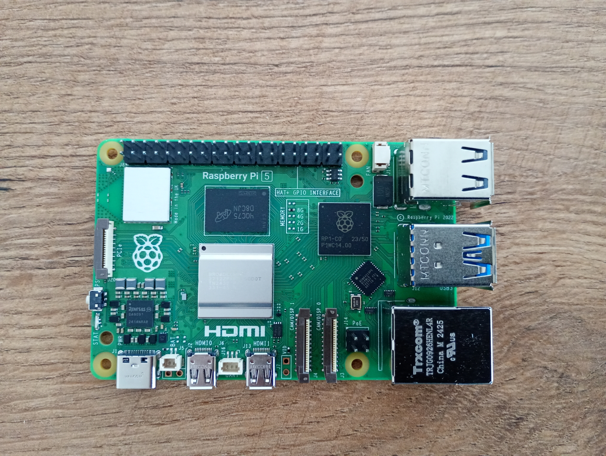
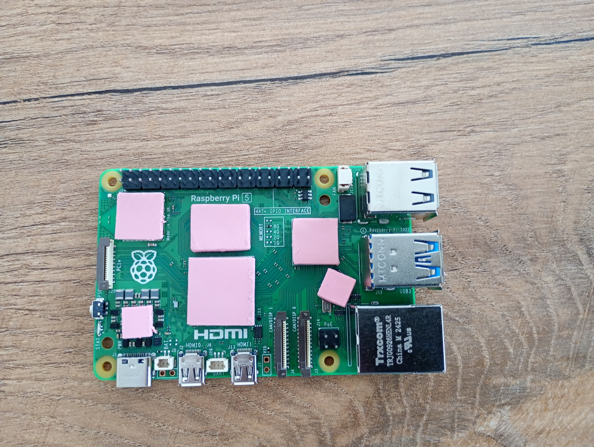
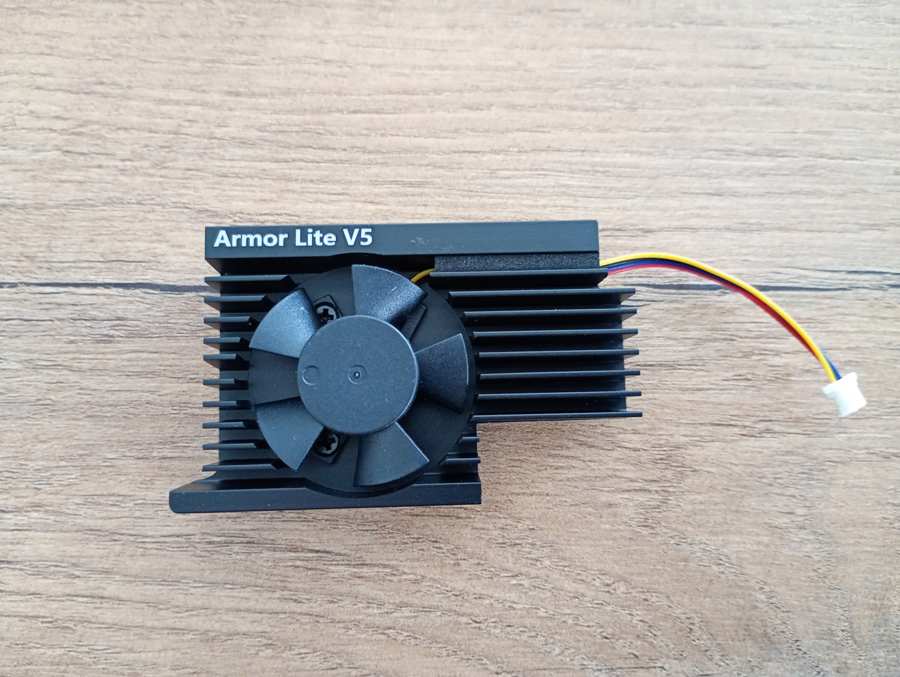
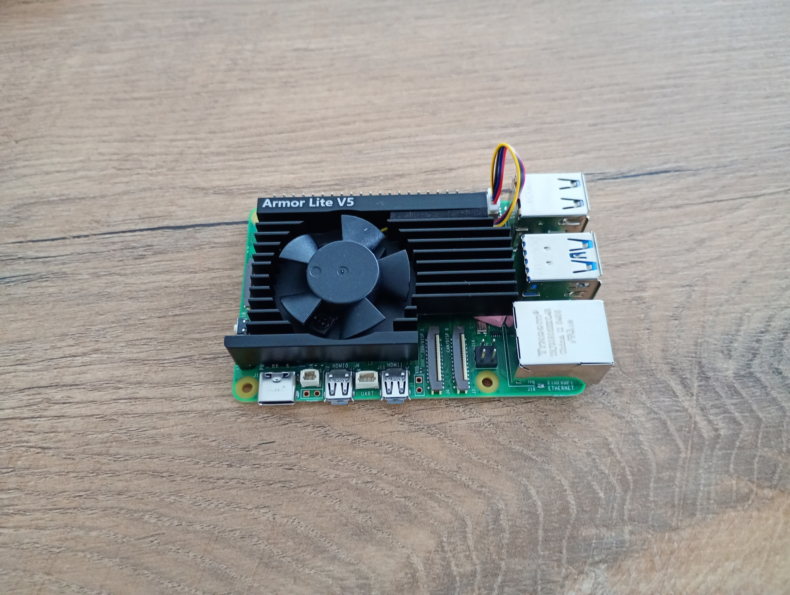
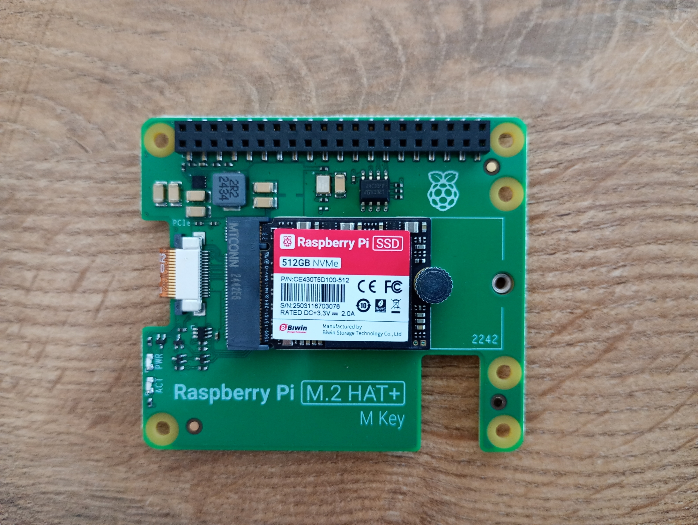
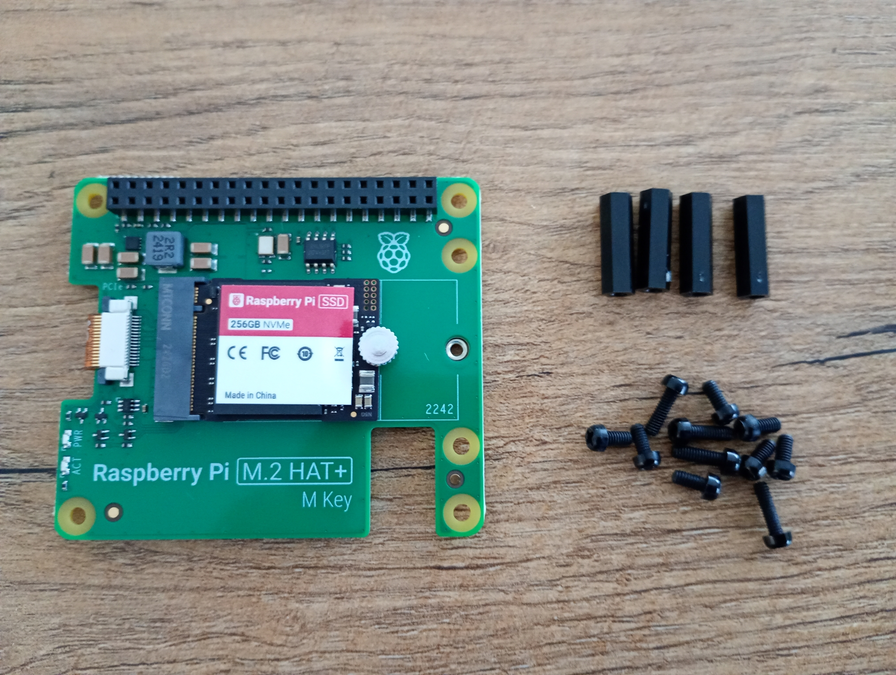
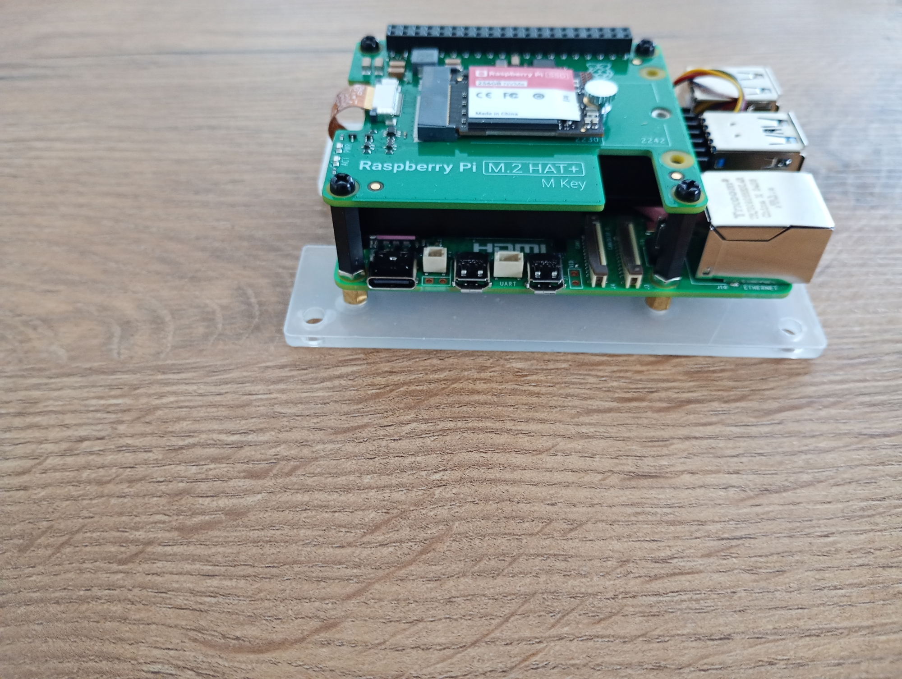
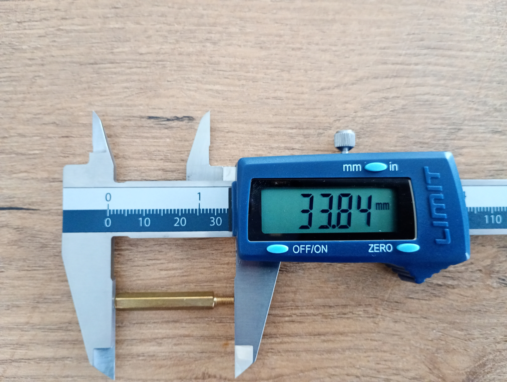
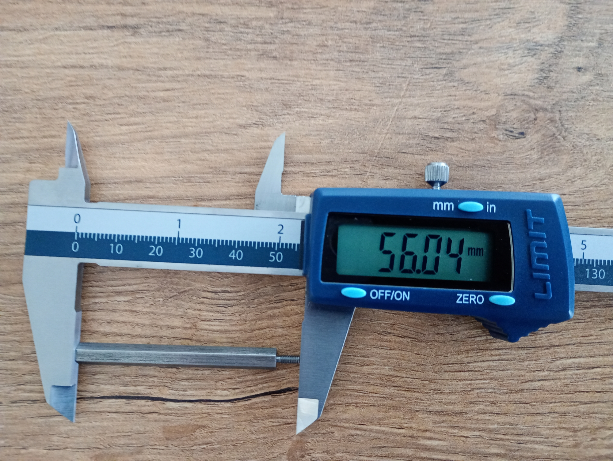
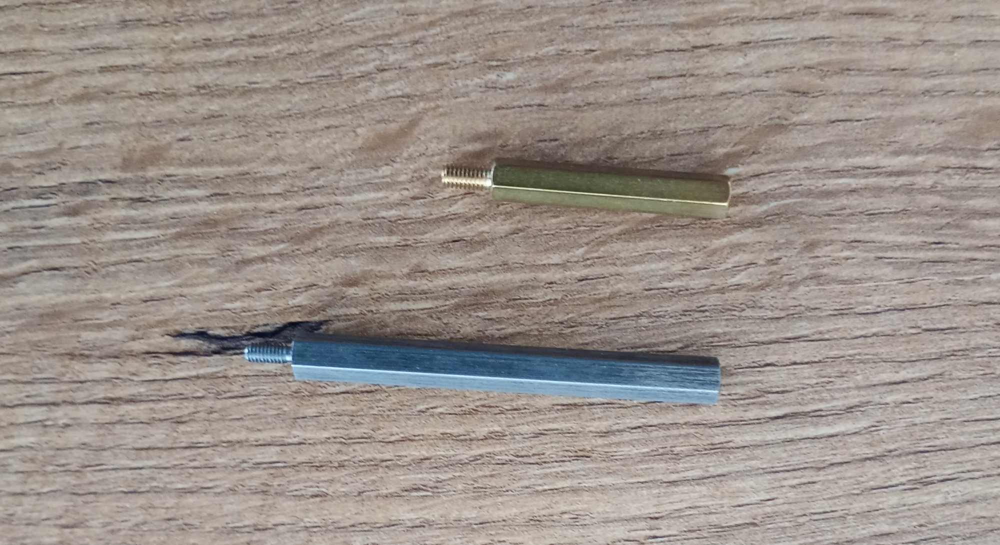

## How things look after unpacking
This page contains photos of used devices and accessories. 

### 1. Raspberry Pi 5

### 2. Raspberry Pi 5 with thermal separators

### 3. Armor Lite V5

### 4. Raspberry Pi 5 with Armor Lite V5

### 5. M2 HAT 
  

### 6. M2 HAT with screws
  

### 7. Raspberry Pi 5 with Armor Lite V5 and M2 HAT 
  

  

### 8. Screws 
- the original screw (it was too short for version with Armor Lite and M2 HAT)
  
- longer screw (I had to buy)
  
- both screws
  