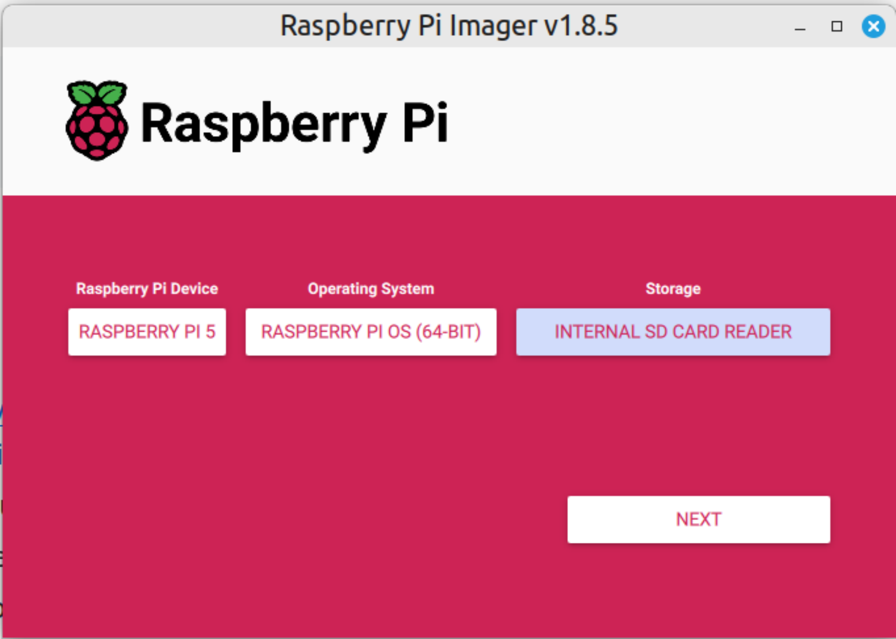
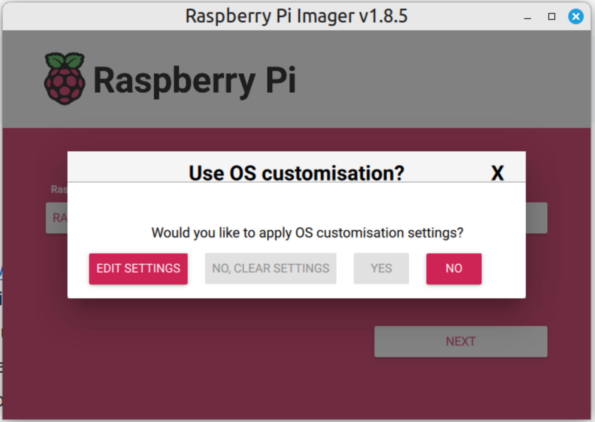
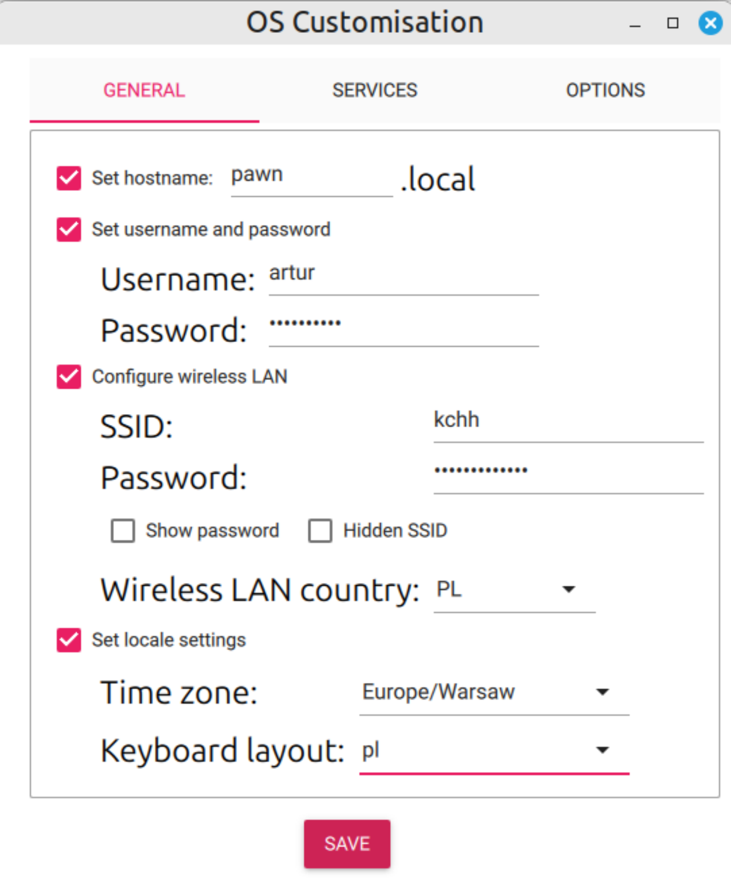
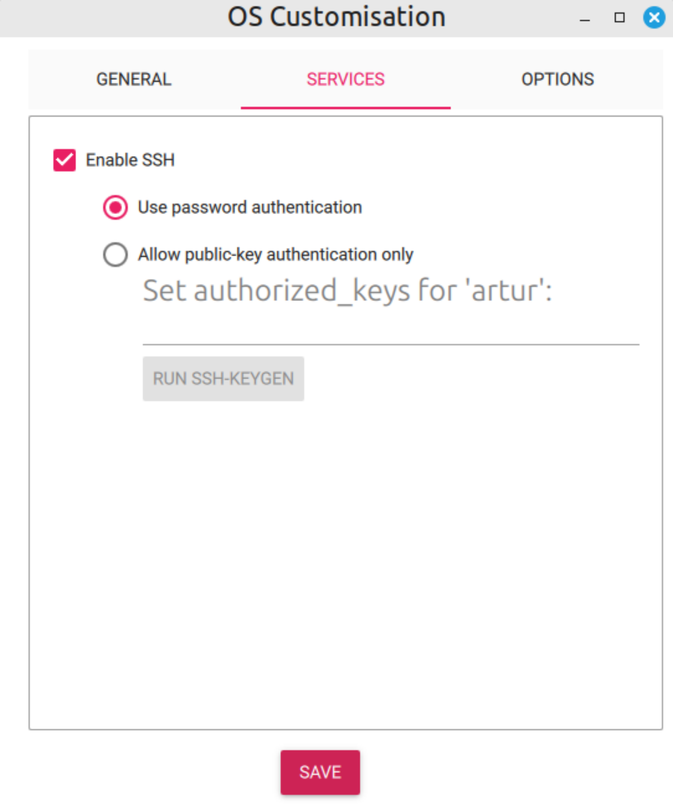
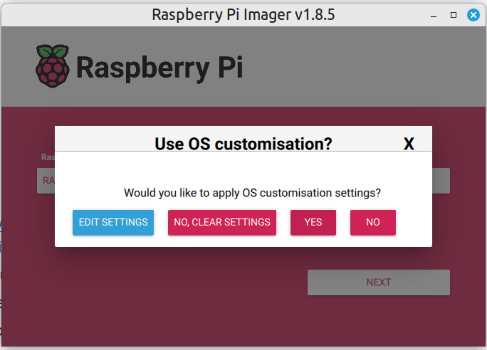
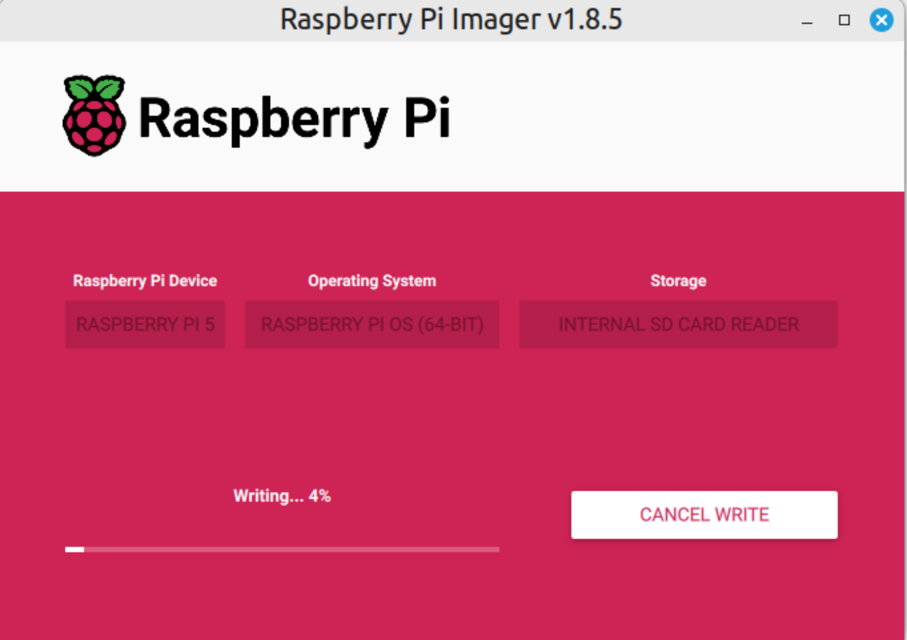

## Software installation for a single RPi (SD card)

#### 1. RPi Imager is recommended for installation OS on Raspberry Pi
- link to [official page](https://www.raspberrypi.com/software/),
- link to [GitHub](https://github.com/raspberrypi/rpi-imager),
- choose a device, OS, and storage (SD card),


- choose 'Edit settings',



- set hostname, username, password, Wi-Fi (if available) and locale settings,


- enable SSH,

- click 'Yes' to apply settings,

- writing OS to the SD card should start



#### 2. Network interfaces
- it's good to know the names of interfaces and the addresses of your machine(s) in the local network.
- my first machine (laptop + Wi-Fi):
```bash
$ ifconfig
enp3s0: flags=4099<UP,BROADCAST,MULTICAST>  mtu 1500
        ether d4:93:90:2a:5e:68  txqueuelen 1000  (Ethernet)
        RX packets 0  bytes 0 (0.0 B)
        RX errors 0  dropped 0  overruns 0  frame 0
        TX packets 0  bytes 0 (0.0 B)
        TX errors 0  dropped 0 overruns 0  carrier 0  collisions 0

lo: flags=73<UP,LOOPBACK,RUNNING>  mtu 65536
        inet 127.0.0.1  netmask 255.0.0.0
        inet6 ::1  prefixlen 128  scopeid 0x10<host>
        loop  txqueuelen 1000  (Local Loopback)
        RX packets 5805  bytes 562751 (562.7 KB)
        RX errors 0  dropped 0  overruns 0  frame 0
        TX packets 5805  bytes 562751 (562.7 KB)
        TX errors 0  dropped 0 overruns 0  carrier 0  collisions 0

wlp0s20f3: flags=4163<UP,BROADCAST,RUNNING,MULTICAST>  mtu 1500
        inet 192.168.18.13  netmask 255.255.255.0  broadcast 192.168.18.255
        inet6 fe80::ba1c:c7e2:3761:bbeb  prefixlen 64  scopeid 0x20<link>
        ether dc:46:28:8b:14:c9  txqueuelen 1000  (Ethernet)
        RX packets 1171156  bytes 1637420945 (1.6 GB)
        RX errors 0  dropped 251  overruns 0  frame 0
        TX packets 234914  bytes 31826155 (31.8 MB)
        TX errors 0  dropped 0 overruns 0  carrier 0  collisions 0
```

- the second machine (PC connected to switch)
```bash
docker0: flags=4099<UP,BROADCAST,MULTICAST>  mtu 1500
        inet 172.17.0.1  netmask 255.255.0.0  broadcast 172.17.255.255
        ether c2:66:6f:37:b6:93  txqueuelen 0  (Ethernet)
        RX packets 0  bytes 0 (0.0 B)
        RX errors 0  dropped 0  overruns 0  frame 0
        TX packets 0  bytes 0 (0.0 B)
        TX errors 0  dropped 0 overruns 0  carrier 0  collisions 0

enp34s0: flags=4163<UP,BROADCAST,RUNNING,MULTICAST>  mtu 1500
        inet 192.168.18.17  netmask 255.255.255.0  broadcast 192.168.18.255
        inet6 fe80::914a:7757:29e5:997  prefixlen 64  scopeid 0x20<link>
        ether 00:d8:61:54:64:82  txqueuelen 1000  (Ethernet)
        RX packets 173771  bytes 199545810 (199.5 MB)
        RX errors 0  dropped 212  overruns 0  frame 0
        TX packets 76599  bytes 17450476 (17.4 MB)
        TX errors 0  dropped 0 overruns 0  carrier 0  collisions 0

lo: flags=73<UP,LOOPBACK,RUNNING>  mtu 65536
        inet 127.0.0.1  netmask 255.0.0.0
        inet6 ::1  prefixlen 128  scopeid 0x10<host>
        loop  txqueuelen 1000  (Local Loopback)
        RX packets 3584  bytes 39513593 (39.5 MB)
        RX errors 0  dropped 0  overruns 0  frame 0
        TX packets 3584  bytes 39513593 (39.5 MB)
        TX errors 0  dropped 0 overruns 0  carrier 0  collisions 0
```

- as you see the private addresses start with `192.168.18.XX` in my home network, yours could be different.
- I set the `pawn.local` name to the hostname and I can ping the RPi, to be sure that it's in the local network:
```bash
ping -c 5 pawn.local
PING pawn.local (192.168.18.23) 56(84) bytes of data.
64 bytes from 192.168.18.23: icmp_seq=1 ttl=64 time=7.55 ms
64 bytes from 192.168.18.23: icmp_seq=2 ttl=64 time=8.93 ms
64 bytes from 192.168.18.23: icmp_seq=3 ttl=64 time=6.45 ms
64 bytes from 192.168.18.23: icmp_seq=4 ttl=64 time=6.60 ms
64 bytes from 192.168.18.23: icmp_seq=5 ttl=64 time=6.55 ms

--- pawn.local ping statistics ---
5 packets transmitted, 5 received, 0% packet loss, time 4005ms
rtt min/avg/max/mdev = 6.452/7.214/8.927/0.943 ms
```

- now we can SSH to the RPi:
```bash
$ ssh artur@pawn.local
The authenticity of host 'pawn.local (192.168.18.24)' can't be established.
ED25519 key fingerprint is SHA256:ypSChuHB0IsqUYX46RrXNtdZr03Ng/a8Rz1khz8XHX4.
This key is not known by any other names.
Are you sure you want to continue connecting (yes/no/[fingerprint])? yes
Warning: Permanently added 'pawn.local' (ED25519) to the list of known hosts.
artur@pawn.local's password:
Linux pawn 6.12.25+rpt-rpi-2712 #1 SMP PREEMPT Debian 1:6.12.25-1+rpt1 (2025-04-30) aarch64

The programs included with the Debian GNU/Linux system are free software;
the exact distribution terms for each program are described in the
individual files in /usr/share/doc/*/copyright.

Debian GNU/Linux comes with ABSOLUTELY NO WARRANTY, to the extent
permitted by applicable law.
Last login: Tue May 13 02:17:59 2025

artur@pawn:~ $ df -Th
Filesystem     Type      Size  Used Avail Use% Mounted on
udev           devtmpfs  3.9G     0  3.9G   0% /dev
tmpfs          tmpfs     806M   16M  791M   2% /run
/dev/mmcblk0p2 ext4       28G  4.9G   22G  19% /
tmpfs          tmpfs     4.0G  400K  4.0G   1% /dev/shm
tmpfs          tmpfs     5.0M   48K  5.0M   1% /run/lock
/dev/mmcblk0p1 vfat      510M   77M  434M  16% /boot/firmware
tmpfs          tmpfs     806M  208K  805M   1% /run/user/1000
```

- we can't see the NVMe disk at this time because it's not ready.
To check that NVMe drive is connected correctly via M.2 HAT+, we can try:
```bash
$ ls -l /dev/nvme*.
crw------- 1 root root 245, 0 Jul  9 14:58 /dev/nvme0
brw-rw---- 1 root disk 259, 0 Jul  9 14:58 /dev/nvme0n1
```
It's there :)

#### 3. Updating and upgrading
- good option is to run the following commands (or put them in `update_software.sh` script) and use it when needed:
```bash
echo "[1. Updating and upgrading (apt) ......]" &&
sudo apt update &&
sudo apt upgrade &&
sudo apt dist-upgrade &&
echo "" &&
echo "[2. Cleaning Up ......]" &&
sudo apt autoremove &&
sudo apt autoclean &&
sudo apt clean &&
sudo apt autopurge &&
echo "" &&
echo "[3. Done ......!!!!]" &&
echo ""
```
- you can make the script executable by `chmod +x update_software.sh`

- at the first running of the updating script on the freshly installed OS, it may take some time, but later it will not take too long.
- it's almost sure that the system must be rebooted after a script finishes its job:
    ```bash
    $ sudo reboot
    ```

#### 4. Changing hostname (if needed)

Important Considerations:

    The hostname is used to identify your Raspberry Pi on the network.

To set or change the network name (hostname) of your Raspberry Pi, you can use the raspi-config tool, hostnamectl, or by directly editing configuration files. The most straightforward method is using raspi-config.
Using raspi-config:

    Open `raspi-config` by running `sudo raspi-config` in the terminal.
    Navigate to "Network Options" and select "Hostname".
    Enter your desired hostname and confirm.
    Reboot your Raspberry Pi for the changes to take effect.

Using hostnamectl:

    Check the current hostname with hostnamectl or hostname.
    Change the hostname using sudo hostnamectl set-hostname your_new_hostname.
    Edit the `/etc/hosts` file to reflect the change, replacing the old hostname with the new one.
    Reboot your Raspberry Pi.

Directly Editing Files:

    Open the `/etc/hostname` file with a text editor (e.g., sudo nano /etc/hostname).
    Change the existing hostname to your desired name and save the file.
    Open the `/etc/hosts` file and change the hostname there as well.
    Reboot your Raspberry Pi.


Choose a descriptive and easy-to-remember hostname, especially if you have multiple Raspberry Pis.
Ensure the hostname adheres to the allowed character set (letters, numbers, and hyphens).
After changing the hostname, other devices on your network may need to be refreshed or rebooted to see the change.
