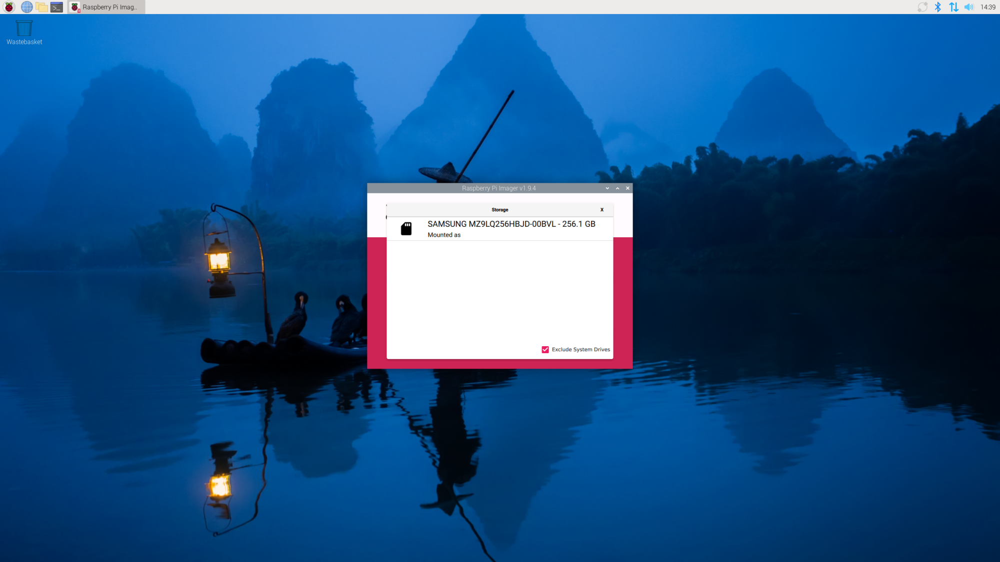
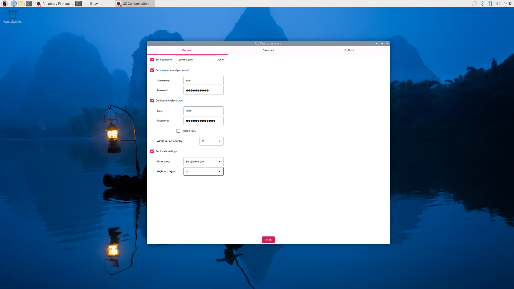
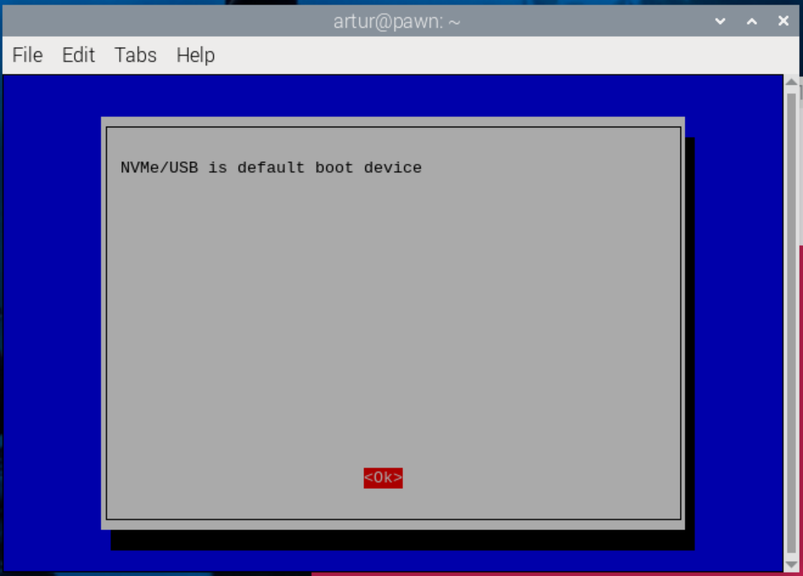

## Software installation for a cluster of RPis (NVMe disks)

#### 1. M.2 HAT+ and NVMe disk
- since we're using SSD Kit (NVMe disk on the top of M.2 HAT+) it's recommended to read the [official documentation](https://www.raspberrypi.com/documentation/accessories/m2-hat-plus.html),
- we need a micro-HDMI cable to connect our RPi to a monitor and also mouse and keyboard,
- to boot from an NVMe drive attached to the M.2 HAT+, complete the following steps:

    1. Start your Raspberry Pi with an SD card with a Raspberry Pi OS image used earlier.

    2. Format your NVMe drive (and install OS) using Raspberry Pi Imager.
       
       

    3. In a terminal on your Raspberry Pi, run `sudo raspi-config` to open the Raspberry Pi Configuration CLI.

    4. Under `Advanced Options > Boot Order`, choose `NVMe/USB boot`. Then, exit `raspi-config` with `Finish` or the `Escape` key.
       

    5. Reboot your Raspberry Pi with `sudo reboot`.

- I've just used the single SD card on every NVMMe disk and changed the hostnames according to the list above,

- I decided to have the following names of my RPis:
    - pawn-cluster.local
    - knight-cluster.local
    - rook-cluster.local
    - queen-cluster.local

- results of the `ping` command (e.g. `ping -c 5 pawn-cluster.local`)
----------------------------------------------
Hostname                IP Address
----------------------------------------------
pawn-cluster.local      192.168.18.19
knight-cluster.local    192.168.18.25
rook-cluster.local      192.168.18.26
queen-cluster.local     192.168.18.27
----------------------------------------------

#### 2. Locale
- sometimes a problem with locales can occur, for example:
```bash
perl: warning: Setting locale failed.
perl: warning: Please check that your locale settings:
	LANGUAGE = (unset),
	LC_ALL = (unset),
	LC_CTYPE = "UTF-8",
	LANG = "en_GB.UTF-8"
    are supported and installed on your system.
perl: warning: Falling back to the standard locale ("C").
locale: Cannot set LC_CTYPE to default locale: No such file or directory
locale: Cannot set LC_ALL to default locale: No such file or directory
```
- solution comes from the [Raspberry Pi forum](https://forums.raspberrypi.com/viewtopic.php?f=50&t=11870),
- you should check your locale:
    - `sudo raspi-config`,
    - check `Localisation Options -> Locale`,
    - choose the locale you need and also pick the default option.

- create or update the `/etc/environment` file with the locale content:
```bash
LANGUAGE=en_GB.UTF-8
LC_ALL=en_GB.UTF-8
LANG=en_GB.UTF-8
LC_TYPE=en_GB.UTF-8
```
> `en_GB.UTF-8` is my default locale, yours can be different!
- after `sudo reboot` you shouldn't see the locale errors anymore.

#### 3. Scanning local network

- you could install and try the `arp-scan` software:
```bash
$ sudo apt install arp-scan
```
- check the interface name and local IP address with `ifconfig` and use it with the name of proper interface:

```bash
$ sudo arp-scan --interface=enp34s0 192.168.18.0/24

Interface: enp34s0, type: EN10MB, MAC: 00:d8:61:54:64:82, IPv4: 192.168.18.17
Starting arp-scan 1.10.0 with 256 hosts (https://github.com/royhills/arp-scan)
192.168.18.1    f8:9b:6e:a0:3f:c0       Nokia Solutions and Networks GmbH & Co. KG
192.168.18.19   2c:cf:67:bf:e2:eb       (Unknown)
192.168.18.25   2c:cf:67:bf:e1:9a       (Unknown)
192.168.18.26   2c:cf:67:bf:e9:84       (Unknown)
192.168.18.27   2c:cf:67:bf:d3:bb       (Unknown)
```
> I've just left only the information about the router and our four RPis.
> In my network I can't see the vendor name next to the RPis, only 'Unknown' information, but maybe you'll see it.

- also, the following command can be used:
```bash
$ sudo arp-scan --interface=enp34s0 --localnet
```

#### 4. Setting static IP inRaspberry Pi
- the problem: every time you reboot your Pi, the IP address can change, based on what the router decides to assign at the moment,
- fortunately, there's a simple way to make sure that your Raspberry Pi always gets the same IP address on your local network or, at least, always tries to get the same address on your local network,
- some solutions were found [here](https://botland.store/content/71-How-to-set-a-static-IP-in-Raspberry-Pi) and [here](https://www.tomshardware.com/how-to/static-ip-raspberry-pi), but with newer version of
- when you check `ifconfig` for your Raspberry Pi, you can see the following interfaces with different IP addresses:
```bash
eth0: flags=4163<UP,BROADCAST,RUNNING,MULTICAST>  mtu 1500
        inet 192.168.18.27  netmask 255.255.255.0  broadcast 192.168.18.255
        inet6 fe80::d86f:6203:8c27:cf8e  prefixlen 64  scopeid 0x20<link>
        ether 2c:cf:67:bf:d3:bb  txqueuelen 1000  (Ethernet)
        RX packets 13748  bytes 2651177 (2.5 MiB)
        RX errors 0  dropped 4847  overruns 0  frame 0
        TX packets 3127  bytes 286238 (279.5 KiB)
        TX errors 0  dropped 0 overruns 0  carrier 0  collisions 0
        device interrupt 112

lo: flags=73<UP,LOOPBACK,RUNNING>  mtu 65536
        inet 127.0.0.1  netmask 255.0.0.0
        inet6 ::1  prefixlen 128  scopeid 0x10<host>
        loop  txqueuelen 1000  (Local Loopback)
        RX packets 28  bytes 3611 (3.5 KiB)
        RX errors 0  dropped 0  overruns 0  frame 0
        TX packets 28  bytes 3611 (3.5 KiB)
        TX errors 0  dropped 0 overruns 0  carrier 0  collisions 0

wlan0: flags=4163<UP,BROADCAST,RUNNING,MULTICAST>  mtu 1500
        inet 192.168.18.22  netmask 255.255.255.0  broadcast 192.168.18.255
        inet6 fe80::6695:2928:d9c4:c8b  prefixlen 64  scopeid 0x20<link>
        ether 2c:cf:67:bf:d3:bc  txqueuelen 1000  (Ethernet)
        RX packets 8297  bytes 1250359 (1.1 MiB)
        RX errors 0  dropped 3813  overruns 0  frame 0
        TX packets 1521  bytes 123571 (120.6 KiB)
        TX errors 0  dropped 0 overruns 0  carrier 0  collisions 0

```
- the names of these interfaces will be used to change the IP of our RPi,
- with the release of Raspberry Pi OS Bookworm, networking on the Raspberry Pi was changed to use NetworkManager as the standard method for managing the network configuration.
- previous Raspberry Pi OS versions used `dhcpcd` for network management,
- it was done in the following way (don't do it!):
  - `sudo nano /etc/dhcpcd.conf` and we had to paste the following content to this file:
    ```bash
        interface eth0
        static ip_address=192.168.18.101/24
        static routers=192.168.18.1
        static domain_name_servers=192.168.18.1

        interface wlan0
        static ip_address=192.168.18.201/24
        static routers=192.168.18.1
        static domain_name_servers=192.168.18.1
    ```
- the above method doesn't work with the newest RPi OS!

- now, the Network Manager is an official tool to change the static IP of RPi,
- solution taken from [here](https://www.abelectronics.co.uk/kb/article/31/set-a-static-ip-address-on-raspberry-pi-os-bookworm),
- the change of IP address is shown on the `queen` machine:

```bash
artur@queen-cluster:~ $ sudo nmcli -p connection show
======================================
  NetworkManager connection profiles
======================================
NAME                UUID                                  TYPE      DEVICE
------------------------------------------------------------------------------------------------------------------
Wired connection 1  cdfa84e0-1cc9-3966-ab9e-9c097f037cfe  ethernet  eth0
lo                  33b70138-a642-4c5a-9c48-c719cec5035e  loopback  lo
preconfigured       c7923d29-7801-4eb5-9e3a-bacd14f4cb1b  wifi      wlan0

artur@queen-cluster:~ $ sudo nmcli c mod "Wired connection 1" ipv4.addresses 192.168.18.104/24 ipv4.method manual
artur@queen-cluster:~ $ sudo nmcli con mod "Wired connection 1" ipv4.gateway 192.168.18.1
artur@queen-cluster:~ $ sudo nmcli con mod "Wired connection 1" ipv4.dns 192.168.18.1
artur@queen-cluster:~ $ sudo nmcli c down "Wired connection 1" && sudo nmcli c up "Wired connection 1"
Connection 'Wired connection 1' successfully deactivated (D-Bus active path: /org/freedesktop/NetworkManager/ActiveConnection/3)
Connection successfully activated (D-Bus active path: /org/freedesktop/NetworkManager/ActiveConnection/5)

artur@queen-cluster:~ $ sudo nmcli c mod "preconfigured" ipv4.addresses 192.168.18.204/24 ipv4.method manual
artur@queen-cluster:~ $ sudo nmcli con mod "preconfigured" ipv4.gateway 192.168.18.1
artur@queen-cluster:~ $ sudo nmcli con mod "preconfigured" ipv4.dns 192.168.18.1
artur@queen-cluster:~ $ sudo nmcli c down "preconfigured" && sudo nmcli c up "preconfigured"
Connection 'preconfigured' successfully deactivated (D-Bus active path: /org/freedesktop/NetworkManager/ActiveConnection/2)
Connection successfully activated (D-Bus active path: /org/freedesktop/NetworkManager/ActiveConnection/4)
```

- after reboot
```bash
artur@queen-cluster:~ $ nmcli -p connection show "Wired connection 1"
===============================================================================
                Connection profile details (Wired connection 1)
===============================================================================
connection.id:                          Wired connection 1
ipv4.addresses:                         192.168.18.104/24

artur@queen-cluster:~ $ nmcli -p connection show "preconfigured"
===============================================================================
                  Connection profile details (preconfigured)
===============================================================================
connection.id:                          preconfigured
ipv4.addresses:                         192.168.18.204/24
```

- checking `ping`
```
$ ping -c 5 queen-cluster.local
PING queen-cluster.local (192.168.18.104) 56(84) bytes of data.
64 bytes from 192.168.18.104: icmp_seq=1 ttl=64 time=0.143 ms
```

- scanning network again with `arp-scan`

```bash
$ sudo arp-scan --interface=enp34s0 192.168.18.0/24
```

#### Summary of IP changes

| Hostname                   | IP Address (eth0) | IP Address (wlan0) |
|----------------------------|-------------------|--------------------|
| pawn-cluster.local         | 192.168.18.101    | 192.168.18.201     |
| knight-cluster.local       | 192.168.18.102    | 192.168.18.202     |
| rook-cluster.local         | 192.168.18.103    | 192.168.18.203     |
| queen-cluster.local        | 192.168.18.104    | 192.168.18.204     |


#### Closing the OS with terminal
- you can use the `sudo poweroff` command to turn off your RPi with command line.
