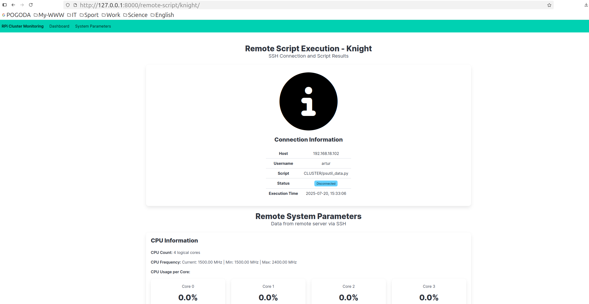

## uv installation on RPi and Django app to monitor system parameters

#### 1. Installation process of 'uv'
- for years `pip` + `venv` was my simple, but effective way to work with Python web applications (especially in Django),
- this time `uv` will be the main tool for Python ecosystem :snake:,
- I used many tips from the [SaaS Pegasus](https://www.saaspegasus.com/guides/uv-deep-dive/) guide on `uv`,
- first, the `uv` must be installed:

```bash
artur@pawn-cluster:~ $ curl -LsSf https://astral.sh/uv/install.sh | sh
downloading uv 0.7.21 aarch64-unknown-linux-gnu
no checksums to verify
installing to /home/artur/.local/bin
  uv
  uvx
everything's installed!

To add $HOME/.local/bin to your PATH, either restart your shell or run:

    source $HOME/.local/bin/env (sh, bash, zsh)
    source $HOME/.local/bin/env.fish (fish)
artur@pawn-cluster:~ $ source $HOME/.local/bin/env
artur@pawn-cluster:~ $ uv --version
uv 0.7.21
```

- we should install `uv` on all remote machines (RPis),
- I've also installed `uv` on my PC, where I'll be developing the Django project,
- to get information about `uv` commands use:
```bash
uv --help
```

- to update `uv` by itself:
```bash
$ uv self update
info: Checking for updates...
success: Upgraded uv from v0.7.21 to v0.8.0! https://github.com/astral-sh/uv/releases/tag/0.8.0
```
#### 2. Django project (created locally)
- I'll start from the "traditional" version - with `SQLite` database and development server (it will be later modified and improved),
- preparing a directory for the new Django project with `uv`:
```bash
$ uv init django_rpi_cluster
Initialized project `django-rpi-cluster` at `/home/artur/Desktop/PROJECTS/RPi-cluster-2025/django_rpi_cluster
```

- creating a virtual environment with `uv`:
```sh
$ cd django_rpi_cluster/
$ uv sync

Using CPython 3.12.3 interpreter at: /usr/bin/python3.12
Creating a virtual environment at: .venv
Resolved 1 package in 2ms
Audited in 0.00ms
```

- installing packages with `uv`:
```sh
$ uv add django
Resolved 5 packages in 563ms
Prepared 3 packages in 1.36s
Installed 3 packages in 175ms
 + asgiref==3.9.1
 + django==5.2.4
 + sqlparse==0.5.3
```

- we can check installed packages with `uv tree`:
```bash
$ uv tree
Resolved 5 packages in 1ms
django-rpi-cluster v0.1.0
└── django v5.2.4
    ├── asgiref v3.9.1
    └── sqlparse v0.5.3
```

- starting a new Django project with `uv`:
```bash
$ uv run django-admin startproject core .
```

- checking if everything works:
```sh
$ uv run manage.py runserver

Watching for file changes with StatReloader
Performing system checks...

System check identified no issues (0 silenced).

You have 18 unapplied migration(s). Your project may not work properly until you apply the migrations for app(s): admin, auth, contenttypes, sessions.
Run 'python manage.py migrate' to apply them.
July 16, 2025 - 18:14:17
Django version 5.2.4, using settings 'core.settings'
Starting development server at http://127.0.0.1:8000/
Quit the server with CONTROL-C.
```
- we can run the following command to get rid of the migration warning:
``sh
 uv run manage.py migrate
```

#### 3. Environment variables
- now we need to create a `.env` file and store sensitive parameters and credentials there,
- this file will not be sent to the remote repository, so you need to create it on your machine,
- all information about using `python-decouple` is available in the documentation mentioned above.
> Of course, we must add the `.env` to `.gitignore`!

- the `.env` may look like this:
```bash
SECRET_KEY=44543n54543u534568$(($**%*U*%*))u1g1
SSH_PASSWORD=yoursecretpasswordisstoredhere12345
```
- the structure of the `.env` file is prepared for the `python-decouple` package (described a few lines below),

#### 4. Django application
- you can find the whole code for a Django project in the `django_rpi_cluster` directory,
- let's add an application called `monitoring`:
```bash
$ uv run manage.py startapp monitoring
```

- let's install the [psutil](https://github.com/giampaolo/psutil) package that will be used for process and system monitoring:
```bash
$ uv add psutil
```

- let's add the [python-decouple](https://pypi.org/project/python-decouple/) package that helps you to organize your settings so that you can change parameters without having to redeploy your app:
```bash
$ uv add python-decouple
```

- the `monitoring` app uses the `psutil` module to get information both from the local machine and from the remote (RPi) machines,
- in the first case we can use it directly and get the following results:
```shell
{'page_title': 'System Parameters', 'cpu_percent': [15.5, 7.0, 7.1, 3.0, 8.0, 11.1, 19.4, 8.2, 3.0, 3.1, 4.0, 9.2, 8.2, 5.1, 6.0, 5.1],
'cpu_count': 16, 'cpu_freq': scpufreq(current=1535.9226250000002, min=1550.0, max=3200.0),
'memory': svmem(total=16682024960, available=7613636608, percent=54.4, used=8586194944, free=3031683072, active=10624380928, inactive=1937760256, buffers=189546496, cached=4874600448, shared=145022976, slab=408702976),
'disk': sdiskusage(total=486773088256, used=81221562368, free=380749557760, percent=17.6), 'network': snetio(bytes_sent=26818350, bytes_recv=389518239, packets_sent=174359, packets_recv=350009, errin=0, errout=0, dropin=10580, dropout=0),
'boot_time': '2025-07-20, 11:34:41', 'load_avg': (1.17822265625, 1.072265625, 0.7705078125), 'process_count': 419}
```
- the `system_parameters` view from `monitoring` app is responsible for that task,

- for example, the `cpu_freq` was returned in the `views.py` and the concrete values can be easily accessed in the Django template, e.g. `cpu_freq.min` gives information about the minimal CPU frequency of a given device,
- on the other hand, to get information about parameters from Raspberry Pi machines, we must connect to them via SSH and run a script on these machines and then get data back,
- we can use the [paramiko](https://docs.paramiko.org/en/stable/) package to achieve this task,
- the `remote_script_execution` view from `monitoring` app is responsible for that task,

#### 5. Scripts on remote machines
- I've installed `uv` on every Raspberry Pi machine, and I've also created the `CLUSTER` project with `uv` in the home directory on every machine:
```bash
artur@knight-cluster:~ $ uv init CLUSTER
Initialized project `cluster` at `/home/artur/CLUSTER`
```

- in the `CLUSTER` directory the file `psutil_data.py` was created:
```python
from datetime import datetime
import psutil


def system_parameters():
    """
    View a function that displays detailed system parameters using psutil.
    Shows CPU, memory, disk, network, and other system information.
    """
    # Get CPU information
    cpu_percent = psutil.cpu_percent(interval=1, percpu=True)
    cpu_count = psutil.cpu_count(logical=True)
    cpu_freq = psutil.cpu_freq()

    # Get memory information
    memory = psutil.virtual_memory()

    # Get disk information
    disk = psutil.disk_usage('/')

    # Get network information
    network = psutil.net_io_counters()

    # Get boot time
    boot_time = psutil.boot_time()
    boot_time = datetime.fromtimestamp(boot_time).strftime("%Y-%m-%d, %H:%M:%S")

    # Get a system load
    load_avg = psutil.getloadavg()

    # Get process information
    process_count = len(psutil.pids())

    context = {
        "page_title": "System Parameters",
        "cpu_percent": cpu_percent,
        "cpu_count": cpu_count,
        "cpu_freq": [cpu_freq.current, cpu_freq.min, cpu_freq.max],
        "memory": [memory.total, memory.available, memory.used, memory.free, memory.percent],
        "disk": [disk.total, disk.used, disk.free, disk.percent],
        "network": [network.bytes_sent, network.bytes_recv, network.packets_sent, network.packets_recv, network.errin, network.errout, network.dropin, network.dropout],
        "boot_time": boot_time,
        "load_avg": [load_avg[0], load_avg[1], load_avg[2]],
        "process_count": process_count,
    }

    return context


print(system_parameters())
```

- we can copy the `psutil_data.py` file from the first RPi to other machines:
```bash
artur@pawn-cluster:~ $ scp CLUSTER/psutil_data.py 192.168.18.102:/home/artur/CLUSTER/
artur@pawn-cluster:~ $ scp CLUSTER/psutil_data.py 192.168.18.103:/home/artur/CLUSTER/
artur@pawn-cluster:~ $ scp CLUSTER/psutil_data.py 192.168.18.104:/home/artur/CLUSTER/
```

- after running the `remote_script_execution` view the `psutil_data.py` script will be executed on the given Raspberry Pi machine and the result will be sent back as a string,
- that's why the `context` dictionary for the local execution is different from the dictionary for the remote execution,
- using `json.loads()` method we can get the JSON data from the string and see the following results:
```shell
{"page_title": "System Parameters", "cpu_percent": [0.0, 0.0, 0.0, 0.0],
"cpu_count": 4, "cpu_freq": [1500.0, 1500.0, 2400.0],
"memory": [8454881280, 7876870144, 465960960, 7098335232, 6.8],
"disk": [251434516480, 5911138304, 232730951680, 2.5], "network": [977675, 22477929, 13294, 55032, 0, 0, 19899, 30],
"boot_time": "2025-07-20, 13:33:50", "load_avg": [0.04541015625, 0.02783203125, 0.00048828125], "process_count": 204}
```
- there are no names like `svmem` or `sdiskusage` in the output result, but only pure JSON,

- you can run it locally and start the `System parameters` link, it will show you the parameters of your machine,
- if you want to get information about parameters from network devices (RPis) you should configure them in the aforementioned way and change the IP values in the `monitoring/views.py` file:
```python
    # Machine to IP address mapping
    machine_ips = {
        'queen': '192.168.18.104',
        'rook': '192.168.18.103',
        'knight': '192.168.18.102',
        'pawn': '192.168.18.101',
    }
```
- information about the one of the machines:

