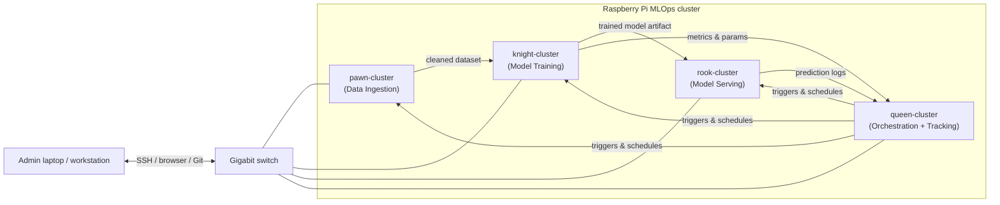
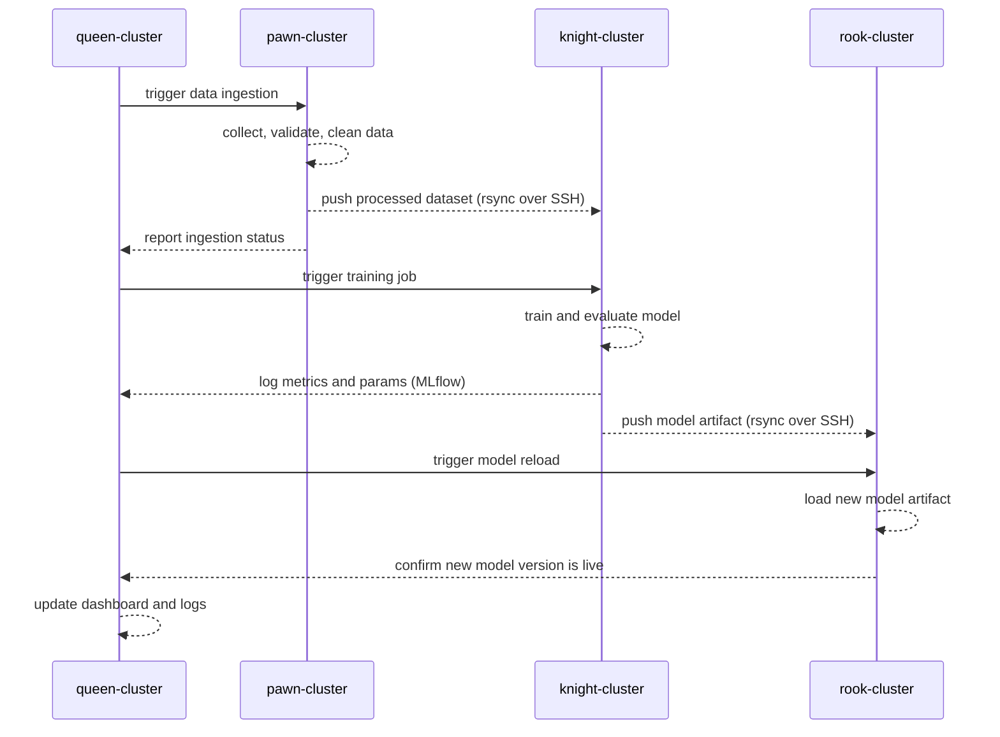

# MLOps System on a Four-Node Raspberry Pi Cluster

This page describes a practical, easy-to-modify MLOps system built on top of the four-node Raspberry Pi cluster documented in this repository. The design is intentionally simple: each node has a single, well-defined role, and the whole pipeline can be understood and changed without specialist infrastructure knowledge.

## Table of Contents
- [Motivation](#motivation)
- [Architecture Overview](#architecture-overview)
- [Node Roles](#node-roles)
  - [pawn-cluster — Data Ingestion Node](#pawn-cluster--data-ingestion-node)
  - [knight-cluster — Training Node](#knight-cluster--training-node)
  - [rook-cluster — Model Serving Node](#rook-cluster--model-serving-node)
  - [queen-cluster — Orchestration and Tracking Node](#queen-cluster--orchestration-and-tracking-node)
- [End-to-End Pipeline Flow](#end-to-end-pipeline-flow)
- [Shared Infrastructure](#shared-infrastructure)
- [Suggested Tools per Node](#suggested-tools-per-node)
- [Extending the System](#extending-the-system)
- [Notes and Limitations](#notes-and-limitations)

---

## Motivation

A four-node Raspberry Pi cluster is a great platform for learning and prototyping MLOps workflows because:
- it is physically small and energy-efficient,
- each node can be assigned a dedicated role that mirrors a real production MLOps stage,
- the whole system runs on your desk without cloud costs,
- Docker and `uv` are already installed on every node (see [05_installing_Docker_on_RPi.md](05_installing_Docker_on_RPi.md) and [06_uv_and_Django_on_RPi.md](06_uv_and_Django_on_RPi.md)),
- the Django monitoring app already gives you a live view of every node's health.

---

## Architecture Overview



The four nodes map directly to the four classic MLOps stages:

| Node | Role | Key responsibility |
|---|---|---|
| `pawn-cluster` | Data Ingestion | Collect, validate, and store raw and processed data |
| `knight-cluster` | Model Training | Run training jobs, evaluate models, export artifacts |
| `rook-cluster` | Model Serving | Serve the latest model via a REST API |
| `queen-cluster` | Orchestration + Tracking | Schedule pipelines, track experiments, store metrics |

---

## Node Roles

### pawn-cluster — Data Ingestion Node

**Purpose:** This node is the entry point for all data. It collects raw data from external sources (files, sensors, APIs, or manual uploads), validates it, transforms it into a clean format, and makes it available to the training node.

**Responsibilities:**
- pull or receive raw data from external sources,
- run basic data validation (schema checks, missing value detection, range checks),
- store raw data in a local directory or a lightweight database (e.g. SQLite),
- export a clean, versioned dataset to a shared location accessible by `knight-cluster`,
- expose a simple status endpoint so `queen-cluster` can confirm that fresh data is ready.

**Suggested setup:**
- a Python script (managed with `uv`) that runs on a schedule or on demand,
- [Great Expectations](https://greatexpectations.io/) or a simple custom validator for data quality checks,
- a shared NFS mount or `rsync` over SSH to push the processed dataset to `knight-cluster`,
- a small Flask or FastAPI app (or a Django view added to the existing monitoring app) to expose a `/data/status` endpoint.

**Example directory layout on the node:**
```
/home/artur/DATA/
├── raw/          # untouched incoming files
├── processed/    # cleaned and validated datasets
└── logs/         # ingestion run logs
```

**Key configuration points:**
- the ingestion script path and schedule are the only things you need to change when switching datasets,
- data validation rules live in a single config file so they are easy to update without touching the pipeline code.

---

### knight-cluster — Training Node

**Purpose:** This node receives the processed dataset from `pawn-cluster`, runs the training job, evaluates the resulting model, and exports the model artifact to `rook-cluster`.

**Responsibilities:**
- pull the latest processed dataset from `pawn-cluster` (via `rsync` or a shared mount),
- run the training script using `uv run`,
- log hyperparameters, metrics (accuracy, loss, F1, etc.) and send them to `queen-cluster`,
- save the trained model artifact (e.g. a `.pkl`, `.onnx`, or `.pt` file) to a versioned directory,
- push the new model artifact to `rook-cluster` when training is complete.

**Suggested setup:**
- [scikit-learn](https://scikit-learn.org/) or [PyTorch](https://pytorch.org/) for model training (choose based on your task complexity),
- [MLflow](https://mlflow.org/) client to log runs to the tracking server on `queen-cluster`,
- a simple shell script or Python script that wraps the full train → evaluate → export cycle,
- `rsync` over SSH (passwordless, already configured — see [07_git_and_passwordless_SSH_configuration.md](07_git_and_passwordless_SSH_configuration.md)) to push the artifact.

**Example directory layout on the node:**
```
/home/artur/TRAINING/
├── data/         # dataset received from pawn-cluster
├── models/       # versioned model artifacts
├── scripts/      # training and evaluation scripts
└── logs/         # training run logs
```

**Key configuration points:**
- hyperparameters are stored in a single `config.yaml` or `.env` file,
- changing the model architecture or algorithm only requires editing the training script; the rest of the pipeline stays the same,
- the model export format (pickle, ONNX, etc.) is defined in one place so `rook-cluster` always knows what to expect.

---

### rook-cluster — Model Serving Node

**Purpose:** This node hosts the trained model and exposes it as a REST API. Any client on the local network (or the admin laptop) can send a request and receive a prediction.

**Responsibilities:**
- receive the latest model artifact from `knight-cluster`,
- load the model and serve predictions via a REST API,
- log every prediction request and response for later analysis,
- support a simple model swap: when a new artifact arrives, reload without restarting the whole service.

**Suggested setup:**
- [FastAPI](https://fastapi.tiangolo.com/) for the prediction API (lightweight, async, auto-generates docs at `/docs`),
- run the API inside a Docker container (Docker is already installed — see [05_installing_Docker_on_RPi.md](05_installing_Docker_on_RPi.md)) so the service is isolated and easy to restart,
- a `POST /predict` endpoint that accepts JSON input and returns a JSON prediction,
- a `GET /health` endpoint that returns the currently loaded model version and node status,
- prediction logs written to a local file and periodically synced to `queen-cluster`.

**Example `docker-compose.yml` for the serving container:**
```yaml
services:
  model-api:
    build: .
    ports:
      - "8080:8080"
    volumes:
      - /home/artur/SERVING/models:/app/models
    restart: unless-stopped
    environment:
      - MODEL_PATH=/app/models/latest.pkl
```

**Example directory layout on the node:**
```
/home/artur/SERVING/
├── models/       # model artifacts received from knight-cluster
├── logs/         # prediction request/response logs
└── api/          # FastAPI application code
```

**Key configuration points:**
- the `MODEL_PATH` environment variable is the only thing you change when deploying a new model version,
- the Docker container can be rebuilt and restarted with a single `docker compose up -d --build` command,
- the API schema (input/output fields) is defined in a Pydantic model inside the FastAPI app, making it easy to adapt to a new task.

---

### queen-cluster — Orchestration and Tracking Node

**Purpose:** This node is the control centre of the MLOps system. It schedules pipeline runs, tracks experiments, stores metrics, and provides a unified dashboard for the whole cluster.

**Responsibilities:**
- schedule and trigger the ingestion, training, and serving steps,
- host the MLflow tracking server to store experiment runs, parameters, and metrics from `knight-cluster`,
- aggregate prediction logs from `rook-cluster` for monitoring model performance over time,
- host the existing Django monitoring app to display live system parameters from all nodes,
- optionally host the GitLab container (already documented in [09_Gitlab_in_Docker_container.md](09_Gitlab_in_Docker_container.md)) for source control and CI.

**Suggested setup:**
- [MLflow](https://mlflow.org/) tracking server running in a Docker container, storing data in a local SQLite database,
- [cron](https://man7.org/linux/man-pages/man8/cron.8.html) or a lightweight scheduler such as [APScheduler](https://apscheduler.readthedocs.io/) to trigger pipeline steps on a schedule,
- the existing Django monitoring app extended with a pipeline status view,
- a simple `pipeline_runner.py` script (managed with `uv`) that SSH-es into each node in sequence and triggers the relevant step.

**Example `docker-compose.yml` for the MLflow tracking server:**
```yaml
services:
  mlflow:
    image: ghcr.io/mlflow/mlflow:latest
    ports:
      - "5000:5000"
    volumes:
      - /home/artur/MLFLOW:/mlflow
    command: >
      mlflow server
      --backend-store-uri sqlite:////mlflow/mlflow.db
      --default-artifact-root /mlflow/artifacts
      --host 0.0.0.0
    restart: unless-stopped
```

**Example directory layout on the node:**
```
/home/artur/ORCHESTRATION/
├── mlflow/           # MLflow database and artifacts
├── logs/             # aggregated logs from all nodes
└── scripts/          # pipeline trigger scripts
```

**Key configuration points:**
- the cron schedule (or APScheduler interval) is the single knob for controlling how often the pipeline runs,
- adding a new pipeline step means adding one SSH call to `pipeline_runner.py` and one cron entry,
- the MLflow tracking URI used by `knight-cluster` is set in a single environment variable: `MLFLOW_TRACKING_URI=http://queen-cluster:5000`.

---

## End-to-End Pipeline Flow

A complete pipeline run follows these steps:



---

## Shared Infrastructure

All four nodes share the following infrastructure that is already in place:

| Component | Where documented |
|---|---|
| Raspberry Pi OS on NVMe | [04_installing_OS_on_RPi-NVMe_disk.md](04_installing_OS_on_RPi-NVMe_disk.md) |
| Docker | [05_installing_Docker_on_RPi.md](05_installing_Docker_on_RPi.md) |
| `uv` Python tooling | [06_uv_and_Django_on_RPi.md](06_uv_and_Django_on_RPi.md) |
| Passwordless SSH between nodes | [07_git_and_passwordless_SSH_configuration.md](07_git_and_passwordless_SSH_configuration.md) |
| Django monitoring app on `pawn-cluster` | [06_uv_and_Django_on_RPi.md](06_uv_and_Django_on_RPi.md) |
| Optional GitLab on `queen-cluster` | [09_Gitlab_in_Docker_container.md](09_Gitlab_in_Docker_container.md) |

---

## Suggested Tools per Node

| Node | Tool | Purpose |
|---|---|---|
| `pawn-cluster` | `uv` + custom Python script | Data ingestion and validation |
| `pawn-cluster` | Great Expectations (optional) | Automated data quality checks |
| `knight-cluster` | scikit-learn / PyTorch | Model training |
| `knight-cluster` | MLflow client | Experiment logging |
| `rook-cluster` | FastAPI | Prediction REST API |
| `rook-cluster` | Docker | Isolated, restartable serving container |
| `queen-cluster` | MLflow server | Experiment tracking and artifact storage |
| `queen-cluster` | cron / APScheduler | Pipeline scheduling |
| `queen-cluster` | Django (existing) | Cluster health monitoring |
| All nodes | `rsync` over SSH | File transfer between nodes |

---

## Extending the System

The design is intentionally minimal so it is easy to grow. Some natural next steps:

- **Add a data versioning layer** — replace the plain `processed/` directory on `pawn-cluster` with [DVC](https://dvc.org/) to track dataset versions alongside model versions.
- **Add automated retraining triggers** — instead of a fixed cron schedule, trigger retraining when data drift is detected (e.g. using [Evidently](https://www.evidentlyai.com/)).
- **Add a model registry** — use the MLflow Model Registry (already part of the MLflow server on `queen-cluster`) to promote models through `Staging → Production` stages before deploying to `rook-cluster`.
- **Add CI/CD** — if GitLab is running on `queen-cluster`, add a `.gitlab-ci.yml` pipeline that runs tests and linting (pre-commit hooks are already configured — see [08_pre-commit.md](08_pre-commit.md)) on every push.
- **Scale training** — if a single `knight-cluster` node is not enough, add a second training node and distribute work with [Ray](https://www.ray.io/) or simple job queuing.

---

## Notes and Limitations

- Raspberry Pi 5 nodes have limited RAM (typically 4 GB or 8 GB), so deep learning training is best kept to small models or transfer learning with frozen base layers.
- NVMe storage (already configured) is strongly recommended for the training and serving nodes because model artifacts and datasets can grow quickly.
- All inter-node communication in this design uses the local Gigabit switch, so latency is low and no VPN or cloud connectivity is required.
- The system described here is a learning and prototyping platform. For production workloads, consider replacing the cron-based scheduler with a proper workflow engine such as [Apache Airflow](https://airflow.apache.org/) or [Prefect](https://www.prefect.io/).
- Security hardening (TLS for the MLflow server and the prediction API, token-based authentication) is out of scope for this document but should be added before exposing any endpoint outside the local network.
