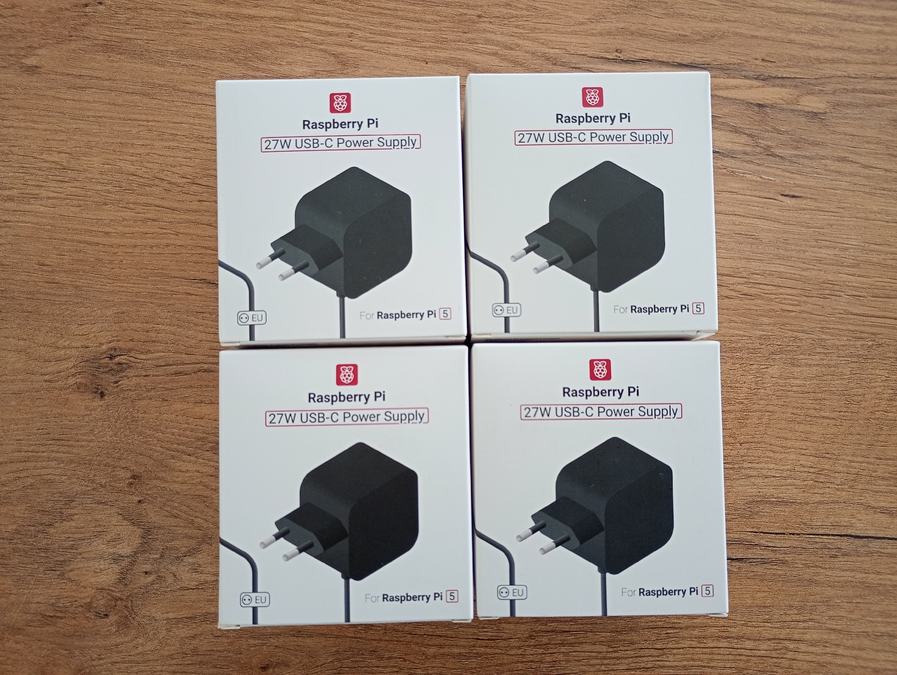
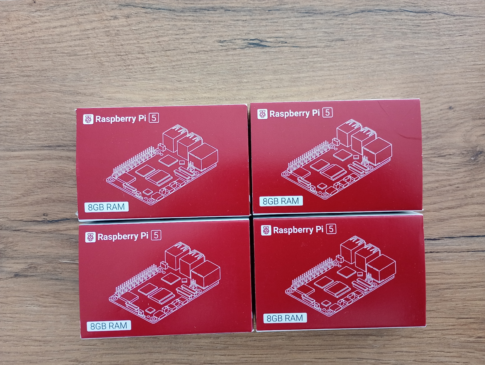

## What do I have?  
This page contains information about the devices and cables used to buid the RPi cluster.  

### 1. Devices and cables
| Product                                                                                                | Number of items | Cost (PLN) |
|:-------------------------------------------------------------------------------------------------------|:---------------:|-----------:|
| Raspberry Pi 27W USB-C Power Supply                                                                    |        4        |        240 |
| Raspberry Pi 5 8GB                                                                                     |        4        |       1560 |
| Memory Card Goodram M1AA microSD 32GB 100MB/s UHS-I Class 10 with adapter                              |        3        |         36 |
| Raspberry Pi SSD Kit 512GB                                                                             |        1        |        279 |
| Switch TP-Link TL-SG108E                                                                               |        1        |        110 |
| Network Cable RJ45 - RJ45, Cat.6, 0.5m                                                                 |        5        |         29 |
| Network Cable UTP Ethernet Cat.6 3m                                                                    |        1        |          8 |
| Voomy Power Cube S5 - Power Strip 4 USB-A & 5 EU                                                       |        1        |        100 |
| GeeekPi 4-layer acrylic housing with Armor Lite V5 Active Cooler radiator for Raspberry Pi 5 4GB / 8GB |        1        |        133 |

**Total cost:** 2495 PLN

### 2. Power supply
- 4 x power supply for Raspberry Pi 5

### 3. Raspberry Pi 5
- 4 x Raspberry Pi 5 with 8 GB

### 1. My cameras (optional)
  - camera [IC-7112W](https://pl.edimax.pl/edimax/merchandise/merchandise_detail/data/edimax/pl/home_network_cameras_indoor_ptz/ic-7112w/)
  - camera [OAK-D Lite](https://docs.luxonis.com/hardware/products/OAK-D%20Lite),
  - camera [CamSpot 5.0 WiFi 1080p](https://botland.com.pl/produkty-wycofane/15582-kamera-ip-overmax-camspot-50-wifi-1080p-5902581657732.html) (not sold already),  
